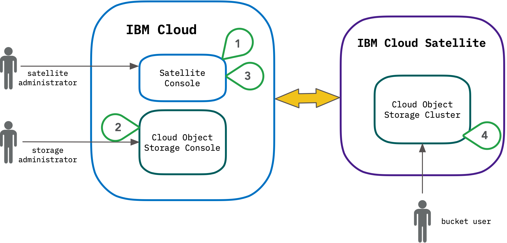
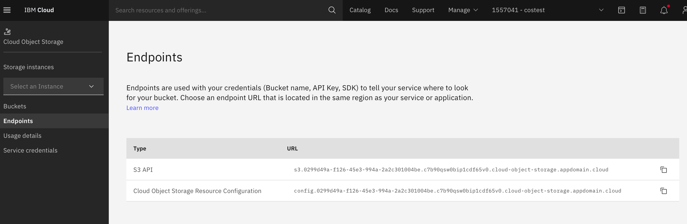

---

copyright:
  years: 2021, 2024
lastupdated: "2024-12-12"

keywords:  object storage, satellite, local

subcollection: cloud-object-storage

---

{{site.data.keyword.attribute-definition-list}}

# About {{site.data.keyword.cos_short}} for {{site.data.keyword.satelliteshort}}
{: #about-cos-satellite}

{{site.data.keyword.cloud_notm}} continues to evaluate its service offerings periodically, keeping in perspective our client requirements and market direction. As a result, as of December 16, 2024, the {{site.data.keyword.cos_short}} for {{site.data.keyword.satelliteshort}} offering is being deprecated. For more information, see [Deprecation overview](/docs/openwhisk?topic=openwhisk-dep-overview).
{: deprecated}

{{site.data.keyword.cos_full_notm}} for {{site.data.keyword.satellitelong_notm}} offers users the flexibility to run a managed {{site.data.keyword.cos_short}} service on client-owned on-premises infrastructure, edge locations or third-party public cloud infrastructure.
{: shortdesc}

This introductory offering of {{site.data.keyword.cos_short}} for {{site.data.keyword.satelliteshort}} is limited in capabilities and will be expanded on in the future. Keep in mind that not all APIs or connected services may work in the same fashion as {{site.data.keyword.cos_short}} on {{site.data.keyword.cloud_notm}}.
{: important}

Essentially, provisioning an instance of {{site.data.keyword.cos_short}} for {{site.data.keyword.satelliteshort}} provides the same familiar interfaces of {{site.data.keyword.cos_full_notm}} outside of {{site.data.keyword.cloud_notm}}.

{{site.data.keyword.cos_short}} is integrated into {{site.data.keyword.satelliteshort}} in three different ways: configuration data and backup storage for the {{site.data.keyword.satelliteshort}} instance itself, as a persistent volume that allows for file-like access, and as a local instance of an {{site.data.keyword.cos_full_notm}} service instance.  This documentation focuses on the latter - setting up and accessing an instance of {{site.data.keyword.cos_short}} running on {{site.data.keyword.satelliteshort}} hardware.
{: note}

## Typical use cases of {{site.data.keyword.cos_short}} for {{site.data.keyword.satelliteshort}}
{: #about-cos-satellite-benefits}

**Low latency workloads** that need to be run in close proximity to on-premises data and applications including workloads running on factory floors for automated operations in manufacturing, real-time patient diagnosis, and media streaming.

**Data residency requirements** or those in regulated industries that need to securely store and process customer data that needs to remain on-premises or in locations where there is no public Cloud Object Storage service.

**Edge or IOT applications** that collect and process data on the edge of network for new workloads from devices and users such as data collection and processing, location-based media, autonomous vehicle data, analytics, and machine data controls for manufacturing.

**Hybrid workloads** that require management of data between on-premises infrastructure, edge, public cloud or any multi-cloud installation.

## How {{site.data.keyword.cos_short}} for {{site.data.keyword.satelliteshort}} works
{: #about-cos-satellite-how}

{: caption="Object Storage for Satellite Architecture"}

1. A {{site.data.keyword.satelliteshort}} administrator needs to configure a new "Location" using the {{site.data.keyword.satelliteshort}} console and assigns hosts for the {{site.data.keyword.satelliteshort}} Control Plane.
2. After the new location is created and accessible, an {{site.data.keyword.cos_short}} administrator provisions the {{site.data.keyword.cos_short}} instance in the new location.
3. The {{site.data.keyword.satelliteshort}} administrator assigns the appropriate hosts and block storage to the new {{site.data.keyword.cos_short}} for {{site.data.keyword.satelliteshort}} cluster.
4. The new instance is available for both {{site.data.keyword.cos_short}} bucket configuration and data operations.

## Connecting to {{site.data.keyword.cos_short}} for {{site.data.keyword.satelliteshort}}
{: #about-cos-satellite-connecting-how}

In order to interact with object storage, a client makes API calls to a _service endpoint_.  In a Satellite configuration, these should not be confused with [_link endpoints_](/docs/satellite?topic=satellite-link-location-cloud) which are used for communication between services.

The _service endpoint_ that is used for reading and writing data typically takes the form of `https://s3.{cos-instance-uuid}.{location-id}.cloud-object-storage.appdomain.cloud` and can be found under the **Endpoints** section of the object storage console.

{: caption="Object Storage for Satellite Endpoints"}

Keep in mind that requests made to {{site.data.keyword.cos_short}} for {{site.data.keyword.satelliteshort}} infrastructure must originate within the satellite location as the service endpoint may not be accessible from the outside of that location.
{: note}

## What features are currently supported?
{: #about-cos-satellite-supported}

* [{{site.data.keyword.cloud_notm}} IAM access policies](/docs/cloud-object-storage?topic=cloud-object-storage-iam)
* [Object Expiration](/docs/cloud-object-storage?topic=cloud-object-storage-expiry)
* [Object Versioning](/docs/cloud-object-storage?topic=cloud-object-storage-versioning)
* [Object Tagging](/docs/cloud-object-storage?topic=cloud-object-storage-object-tagging)
* [Static Web hosting](/docs/cloud-object-storage?topic=cloud-object-storage-static-website-options)
* [Key Protect managed encryption](/docs/cloud-object-storage?topic=cloud-object-storage-kp)

Any Key Protect instances must be in {{site.data.keyword.cloud_notm}} and must be located in the same IBM Cloud region from where the Satellite location is managed.
{: important}

Activity Tracking events are produced for service instance creation and deletion, but not any actions specific to object storage, such as listing buckets or reading/writing data.
{: important}

Other features that are currently not supported (such as Activity Tracking, Metrics Monitoring, [Compliance](/docs/cloud-object-storage?topic=cloud-object-storage-compliance), Security and Compliance Center) will be added in the future.
