## Using the sample collection

A Postman Collection is available for [download](files/IBM_COS.postman_collection.json.zip) with configurable {{site.data.keyword.cos_full}} API request samples.

### Import the collection to Postman
1. In Postman click on Import in the upper right  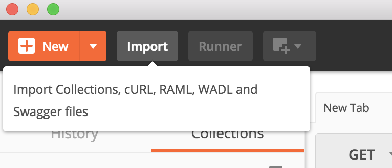 `Figure 1: Import menu`  
2. From the Import window either drag and drop the Collection file into the window or click Choose Files and browse to the folder and select the Collection file.  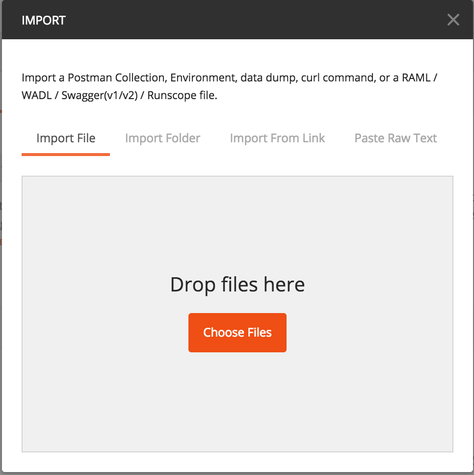 `Figure 2: Importing the Collection`  
3. *IBM COS Samples* should now appear in the Collections window  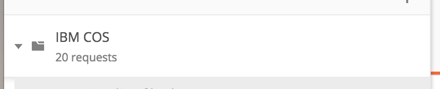 `Figure 3: Collection imported and available`  
4. Expand the Collection and see six (6) sample requests  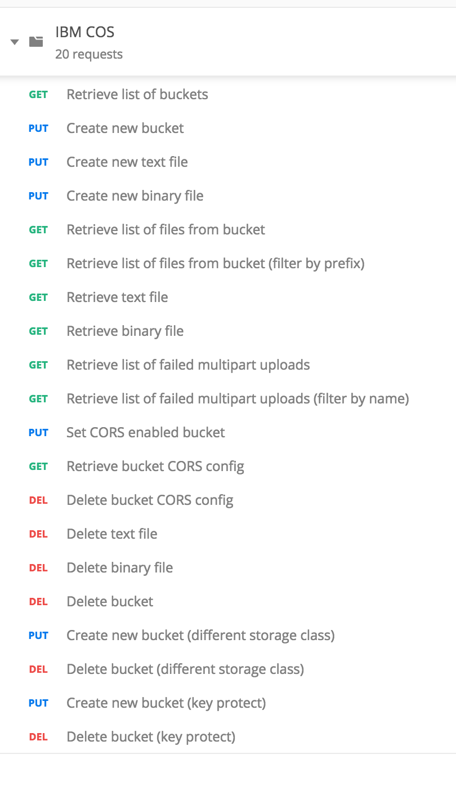 `Figure 4: Available API requests`  
5. The Collection contains four (4) variables that will need to be set in order to successfully execute
    * Click on the three dots to expand the menu and click Edit 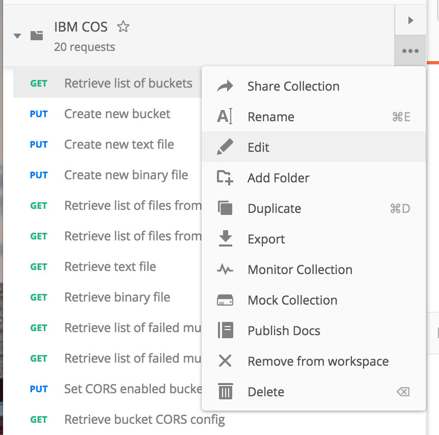 `Figure 5: Edit the Collection to set the variables`  
6. Edit the variables to match your Cloud Storage environment 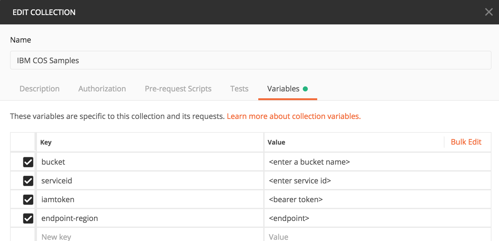 `Figure 6: Update the variables`
    * bucket - Enter the name for the new bucket you wish to create (bucket names must be unique across Cloud Storage).
    * serviceid - Enter the CRN of your Cloud Storage service.  Instructions to obtain your CRN are available [here](/docs/services/cloud-object-storage/getting-started-cli.html#gather-key-information).
    * iamtoken - Enter the OAUTH token for your Cloud Storage service.  Instructions to objtain your OAUTH token are available [here](/docs/services/cloud-object-storage/getting-started-cli.html#gather-key-information).
    * endpoint-region - Enter the regional endpoint for your Cloud Storage service.  Obtain the available endpoints from the [IBM Cloud Dashboard](https://console.bluemix.net/dashboard/apps/){:new_window}
        * You will only need to enter beginning part of the Endpoint URL.  Acceptable values include:
            * s3-api.us-geo
            * s3-api.dal-us-geo
            * s3.us-south
            * s3.eu-gb
7. Click on Update

### Running the samples

The API sample requests are fairly straightforward and easy to use.  They are designed to run in order and demonstrate how to interact with Cloud Storage.

<table>
    <tr>
        <th>Request</th>
        <th>Expected Result</th>
        <th>Test Results</th>
    </tr>
    <tr>
        <td>Create new bucket</td>
        <td>
            <ul>
                <li>Click on <strong>Send</strong></li>
                <li>
                    You should receive a Status Code 200 OK 
                    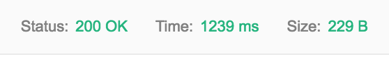
                </li>
            </ul>
        </td>
        <td>
            <ul>
                <li>
                    The Test Results tab should show a success 
                    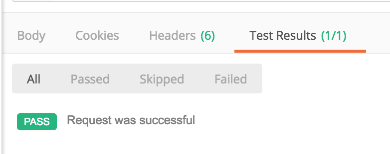
                </li>
            </ul>
        </td>
    </tr>
    <tr>
        <td>Create new text file</td>
        <td>
            <ul>
                <li>
                    Click on Body and add or update the text in the box 
                    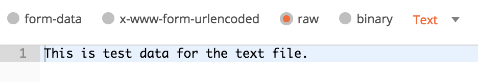
                </li>
                <li>Click on <strong>Send</strong></li>
                <li>
                    You should receive a Status Code 200 OK 
                    
                </li>
            </ul>
        </td>
        <td>
            <ul>
                <li>
                    The Test Results tab should show 2 success 
                    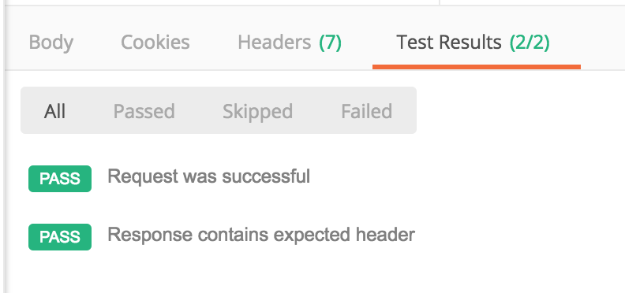
                </li>
            </ul>
        </td>        
    </tr>
    <tr>
        <td>Create new binary file</td>
        <td>
            <ul>
                <li>
                    Click on Body and click on Choose File to select an image to upload 
                    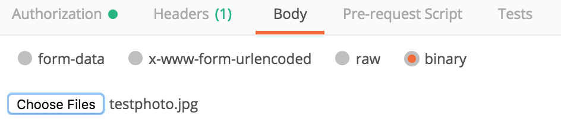
                </li>
                <li>Click on <strong>Send</strong></li>
                <li>
                    You should receive a Status Code 200 OK 
                    
                </li>
            </ul>
        </td>
        <td>
            <ul>
                <li>
                    The Test Results tab should show 2 success 
                    
                </li>
            </ul>
        </td>        
    </tr>
    <tr>
        <td>Retrieve list of files from bucket</td>
        <td>
            <ul>
                <li>Click on <strong>Send</strong></li>
                <li>
                    You should receive a Status Code 200 OK 
                    
                </li>
                <li>
                    In the Body of the response you should see the two files you created in the previous requests 
                    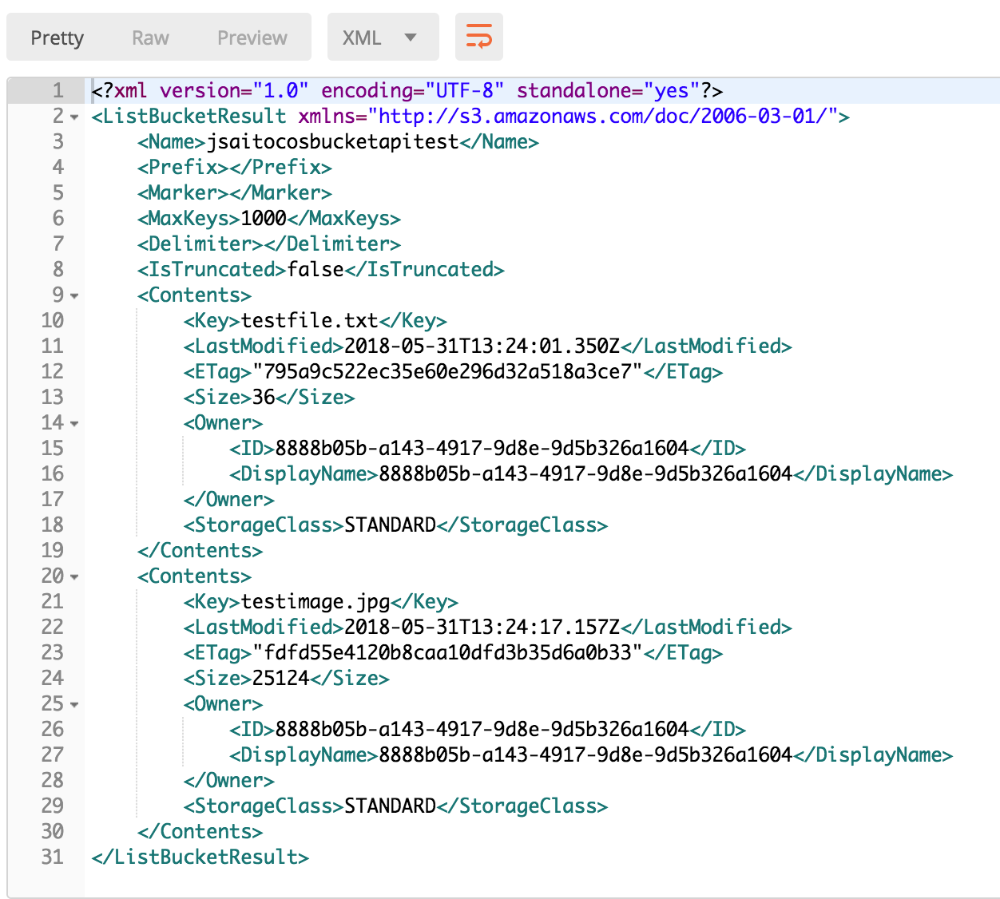
                </li>
            </ul>
        </td>
        <td>
            <ul>
                <li>
                    The Test Results tab should show 2 success 
                    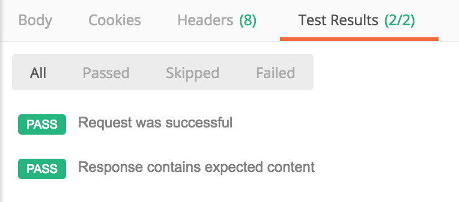
                </li>
            </ul>
        </td>        
    </tr>
    <tr>
        <td>Retrieve text file</td>
        <td>
            <ul>
                <li>Click on <strong>Send</strong></li>
                <li>
                    You should receive a Status Code 200 OK 
                    
                </li>
                <li>
                    In the Body of the response you should see the text you entered in the previous request 
                    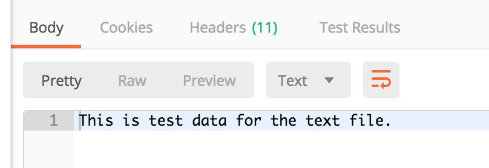
                </li>
            </ul>
        </td>
        <td>
            <ul>
                <li>
                    The Test Results tab should show 3 success 
                    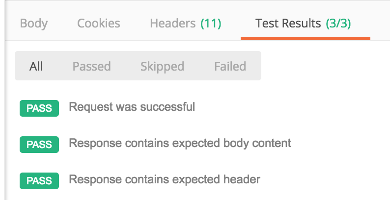
                </li>
            </ul>
        </td>        
    </tr>
    <tr>
        <td>Retrieve binary file</td>
        <td>
            <ul>
                <li>Click on <strong>Send</strong></li>
                <li>
                    You should receive a Status Code 200 OK 
                    
                </li>
                <li>
                    In the Body of the response you should see the text you entered in the previous request 
                    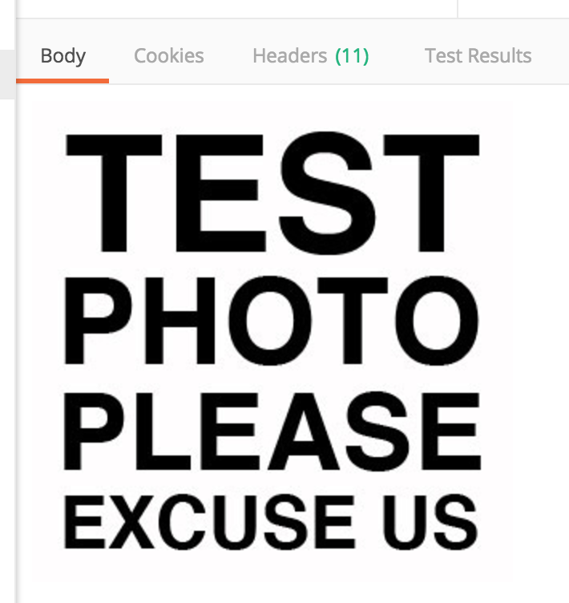
                </li>
            </ul>
        </td>
        <td>
            <ul>
                <li>
                    The Test Results tab should show 2 success 
                    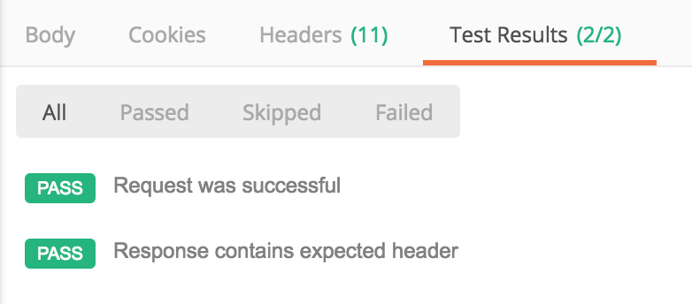
                </li>
            </ul>
        </td>                
    </tr>
</table>