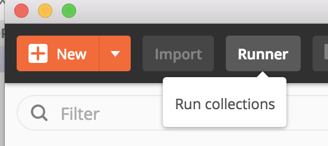
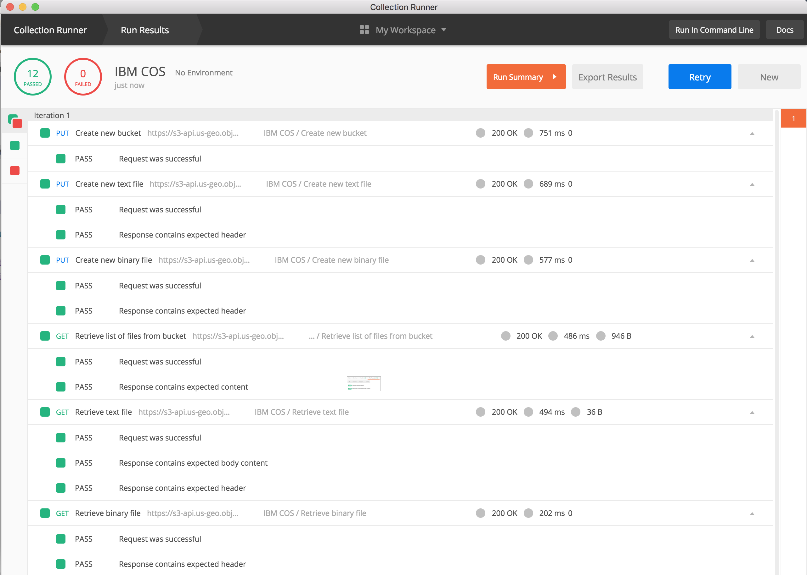

## Using the sample collection

A Postman Collection is available for [download](files/IBM_COS.postman_collection.json.zip) with configurable {{site.data.keyword.cos_full}} API request samples.

### Import the collection to Postman
1. In Postman click on Import in the upper right   `Figure 1: Import menu`  
2. From the Import window either drag and drop the Collection file into the window or click Choose Files and browse to the folder and select the Collection file.   `Figure 2: Importing the Collection`  
3. *IBM COS Samples* should now appear in the Collections window   `Figure 3: Collection imported and available`  
4. Expand the Collection and see twenty (20) sample requests   `Figure 4: Available API requests`  
5. The Collection contains six (6) variables that will need to be set in order to successfully execute
    * Click on the three dots to expand the menu and click Edit  `Figure 5: Edit the Collection to set the variables`  
6. Edit the variables to match your Cloud Storage environment  `Figure 6: Update the variables`
    * bucket - Enter the name for the new bucket you wish to create (bucket names must be unique across Cloud Storage).
    * serviceid - Enter the CRN of your Cloud Storage service.  Instructions to obtain your CRN are available [here](/docs/services/cloud-object-storage/getting-started-cli.html#gather-key-information).
    * iamtoken - Enter the OAUTH token for your Cloud Storage service.  Instructions to objtain your OAUTH token are available [here](/docs/services/cloud-object-storage/getting-started-cli.html#gather-key-information).
    * endpoint - Enter the regional endpoint for your Cloud Storage service.  Obtain the available endpoints from the [IBM Cloud Dashboard](https://console.bluemix.net/dashboard/apps/){:new_window}
        * Acceptable values include:
            * s3-api.us-geo.objectstorage.softlayer.net
            * s3.us-south.objectstorage.softlayer.net
            * s3.eu-gb.objectstorage.softlayer.net
        * *Ensure that your selected endpoint matches your key protect service to ensure the samples run correctly*
7. Click on Update

### Running the samples

The API sample requests are fairly straightforward and easy to use.  They are designed to run in order and demonstrate how to interact with Cloud Storage.  They can also be used to run a functional test against your Cloud Storage service to ensure proper operation.

<table>
    <tr>
        <th>Request</th>
        <th>Expected Result</th>
        <th>Test Results</th>
    </tr>
    <tr>
        <td>Retrieve list of buckets</td>
        <td>
            <ul>
                <li>Status Code 200 OK</li>
                <li>
                    In the Body you should set an XML list of the buckets in your cloud storage.
                </li>
            </ul>
        </td>
        <td>
            <ul>
                <li>Request was successful</li>
                <li>Response contains expected content</li>
            </ul>
        </td>
    </tr>
    <tr>
        <td>Create new bucket</td>
        <td>
            <ul>
                <li>Status Code 200 OK</li>
            </ul>
        </td>
        <td>
            <ul>
                <li>Request was successful</li>
            </ul>
        </td>
    </tr>
    <tr>
        <td>Create new text file</td>
        <td>
            <ul>
                <li>Status Code 200 OK</li>
            </ul>
        </td>
        <td>
            <ul>
                <li>Request was successful</li>
                <li>Response contains expected header</li>
            </ul>
        </td>        
    </tr>
    <tr>
        <td>Create new binary file</td>
        <td>
            <ul>
                <li>
                    Click on Body and click on Choose File to select an image to upload
                </li>
                <li>Status Code 200 OK</li>
            </ul>
        </td>
        <td>
            <ul>
                <li>Request was successful</li>
                <li>Response contains expected header</li>
            </ul>
        </td>        
    </tr>
    <tr>
        <td>Retrieve list of files from bucket</td>
        <td>
            <ul>
                <li>Status Code 200 OK</li>
                <li>
                    In the Body of the response you should see the two files you created in the previous requests
                </li>
            </ul>
        </td>
        <td>
            <ul>
                <li>Request was successful</li>
                <li>Response contains expected header</li>
            </ul>
        </td>        
    </tr>
    <tr>
        <td>Retrieve list of files from bucket (filter by prefix)</td>
        <td>
            <ul>
                <li>Change the querystring value to prefix=&lt;some text&gt;</li>
                <li>Status Code 200 OK</li>
                <li>
                    In the Body of the response you should see the files with names that start with the prefix specified
                </li>
            </ul>
        </td>
        <td>
            <ul>
                <li>Request was successful</li>
                <li>Response contains expected header</li>
            </ul>
        </td>        
    </tr>
    <tr>
        <td>Retrieve text file</td>
        <td>
            <ul>
                <li>Status Code 200 OK</li>
                <li>
                    In the Body of the response you should see the text you entered in the previous request
                </li>
            </ul>
        </td>
        <td>
            <ul>
                <li>Request was successful</li>
                <li>Response contains expected body content</li>
                <li>Response contains expected header</li>
            </ul>
        </td>        
    </tr>
    <tr>
        <td>Retrieve binary file</td>
        <td>
            <ul>
                <li>Status Code 200 OK</li>
                <li>
                    In the Body of the response you should see the image you chose in the previous request
                </li>
            </ul>
        </td>
        <td>
            <ul>
                <li>Request was successful</li>
                <li>Response contains expected header</li>
            </ul>
        </td>                
    </tr>
    <tr>
        <td>Retrieve list of failed multipart uploads</td>
        <td>
            <ul>
                <li>Status Code 200 OK</li>
                <li>
                    In the Body of the response you should see any failed multipart uploads for the bucket
                </li>
            </ul>
        </td>
        <td>
            <ul>
                <li>Request was successful</li>
                <li>Response contains expected content</li>
            </ul>
        </td>        
    </tr>
    <tr>
        <td>Retrieve list of failed multipart uploads (filter by name)</td>
        <td>
            <ul>
                <li>Change the querystring value to prefix=&lt;some text&gt;</li>
                <li>Status Code 200 OK</li>
                <li>
                    In the Body of the response you should see any failed multipart uploads for the bucket with names that start with the prefix specified
                </li>
            </ul>
        </td>
        <td>
            <ul>
                <li>Request was successful</li>
                <li>Response contains expected content</li>
            </ul>
        </td>        
    </tr>
    <tr>
        <td>Set CORS enabled bucket</td>
        <td>
            <ul>
                <li>Status Code 200 OK</li>
            </ul>
        </td>
        <td>
            <ul>
                <li>Request was successful</li>
            </ul>
        </td>                
    </tr>
    <tr>
        <td>Retrieve bucket CORS config</td>
        <td>
            <ul>
                <li>Status Code 200 OK</li>
                <li>
                    In the Body of the response you should see the CORS configuration set for the bucket
                </li>
            </ul>
        </td>
        <td>
            <ul>
                <li>Request was successful</li>
                <li>Response contains expected content</li>
            </ul>
        </td>        
    </tr>
    <tr>
        <td>Delete bucket CORS config</td>
        <td>
            <ul>
                <li>Status Code 200 OK</li>
            </ul>
        </td>
        <td>
            <ul>
                <li>Request was successful</li>
            </ul>
        </td>                
    </tr>
    <tr>
        <td>Delete text file</td>
        <td>
            <ul>
                <li>Status Code 200 OK</li>
            </ul>
        </td>
        <td>
            <ul>
                <li>Request was successful</li>
            </ul>
        </td>                
    </tr>
    <tr>
        <td>Delete binary file</td>
        <td>
            <ul>
                <li>Status Code 200 OK</li>
            </ul>
        </td>
        <td>
            <ul>
                <li>Request was successful</li>
            </ul>
        </td>                
    </tr>
    <tr>
        <td>Delete bucket</td>
        <td>
            <ul>
                <li>Status Code 200 OK</li>
            </ul>
        </td>
        <td>
            <ul>
                <li>Request was successful</li>
            </ul>
        </td>                
    </tr>
    <tr>
        <td>Create new bucket (different storage class)</td>
        <td>
            <ul>
                <li>Status Code 200 OK</li>
            </ul>
        </td>
        <td>
            <ul>
                <li>Request was successful</li>
            </ul>
        </td>                
    </tr>
    <tr>
        <td>Delete bucket (different storage class)</td>
        <td>
            <ul>
                <li>Status Code 200 OK</li>
            </ul>
        </td>
        <td>
            <ul>
                <li>Request was successful</li>
            </ul>
        </td>                
    </tr>
    <tr>
        <td>Create new bucket (key protect)</td>
        <td>
            <ul>
                <li>Status Code 200 OK</li>
            </ul>
        </td>
        <td>
            <ul>
                <li>Request was successful</li>
            </ul>
        </td>                
    </tr>
    <tr>
        <td>Delete bucket (key protect)</td>
        <td>
            <ul>
                <li>Status Code 200 OK</li>
            </ul>
        </td>
        <td>
            <ul>
                <li>Request was successful</li>
            </ul>
        </td>                
    </tr>
</table>

## Using the Postman Collection Runner

The Postman Collection Runner provides a user interface for testing a collection and allows you to run all requests in a Collection at once. 

To try it, click on the Runner button in the main Postman window:

In the Runner window, select your collection and click on the big blue Run button below:

Your tests will run, and you'll get the results to your Tests displayed:
