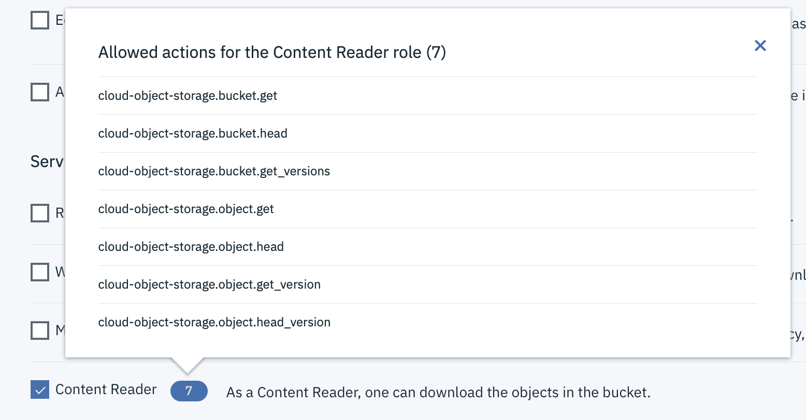

---

copyright:
  years: 2023
lastupdated: "2023-09-01"

keywords: access control, iam, basics, objects

subcollection: cloud-object-storage

---

{{site.data.keyword.attribute-definition-list}}

# Assigning access to objects within a bucket using IAM access conditions
{: #fgac-iam-access-conditions}

IAM access policies allow granting permissions in a COS bucket to specific groups of objects. This approach allows for fine-grained access control over data access, making it useful in scenarios where different parts of a bucket need to be accessed by different users or applications.
{: shortdesc}

If access is required for the entire bucket, when fine grained access control is not required, then follow the information on [assinging access to an individual bucket](/docs/cloud-object-storage?topic=cloud-object-storage-iam-bucket-permissions&interface=ui).
{: important}

Each object stored in a COS bucket has a unique key, and these keys often follow a hierarchical structure similar to a file system. For example, an individual object with the key **folder1/subfolder1/file.txt** can simulate a folder or directory hierarchy, where the directory  **folder1** contains a sub-directory named **subfolder1** containing a file **file.txt**. Access can be assigned at any folder level.

**Example**: An access policy can be created for all objects and subfolders in the folder named **folder1**, or access can be assigned for just objects in the subdirectory named **subfolder1**.

A policy administrator can assign access to individual objects and folders by configuring conditions when creating IAM access policies. The next section describes how to construct these types of policies

## Constructing a Fine-Grained Access Control Policy
{: #fgac-construct-policy}

The first step to granting access to individual objects within a bucket is to construct an IAM policy. You can find more information on constructing an IAM access policy for Cloud Object Storage in the COS tutorial [Limiting access to a single Object Storage bucket](/docs/cloud-object-storage?topic=cloud-object-storage-limit-access&interface=ui#single-bucket-create-policy). For more general information on building IAM policies, please go to [How IBM Cloud IAM works](/docs/account?topic=account-iamoverview). Let’s define some of the key concepts for an access policy.

## Terminology
{: #fgac-terminology}

Key Concepts: The following items are key components of building an IAM access policy for your Cloud Object Storage resources.

**Subject**: The subject of an access policy can be an individual user, an access group, a Service ID, or a Trusted Profile. See [What are IAM policies and who can assign them?](docs/account?topic=account-iamusermanpol) for more information on the types of subjects you can apply to a policy.

**Service**: The service is the IBM Cloud Service that contains the resource you are trying to assign access to. For assigning access to individual objects use the Cloud Object Storage service.

**Resource**: IBM COS supports the following resource targets: a resource group ID, a service instance, a resource type with value of “bucket”, and a resource ID (bucket name).

**Role**: IBM Cloud access roles are groups of actions. Access roles allow the subject to complete specific tasks within the context of the target resources that are defined in the policy. COS supports several pre-defined service roles that makes assigning permissions easier. COS also allows the creation of custom roles. See [Identity and Access Management roles](/docs/cloud-object-storage?topic=cloud-object-storage-iam&interface=ui#iam-roles) for more information on the supported roles for COS. Only the following roles are recommended for assigning individual object access:
- `Object Writer`
- `Object Deleter`
- `Object Lister`
- `Object Reader`
- `WriterNoConditions`

See table 1. for the list of COS roles and their interaction with conditions.

**Condition**: Once a resource is identified, a condition can be used to further scope access for a subject to individual objects in a bucket. This is referred to as fine-grained access control. Use a policy with no condition attributes to give full access to the target resource. A single IAM Policy can have more than one condition by using an OR or AND statement to combine the conditions. The condition statement (containing one or more conditions) should evaluate to TRUE for the user request to be permitted to perform the action. IAM Policy will deny any action that does not get evaluated to be TRUE/allowed by condition.

Use IAM v2 policy to construct IAM policy containing resource attribute-based conditions using API.
{: tip}

### COS supports the following attributes to specify conditions for assigning fine-grained access on COS resources:
{: #fgac-attributes-supported}

  Prefix/Delimiter: Prefix and Delimiter are used together to scope all listing permissions for specific objects.
    If you want to provide listing access to all objects in the bucket, then do not use a Prefix and Delimiter condition.
    {: tip}
    
    The Prefix condition attribute defines the prefix for the set of object keys that this condition should allow for listing of objects or folders. For example, in the object named "folder1/subfolder1/file.txt", both “folder1/” and “folder1/subfolder1/” are possible prefixes. Using the prefix “folder1/” will grant list access to see the objects directly in “folder1” as well as the names of any possible subfolders directly in “folder1”.
    
    A Delimiter helps the user navigate the bucket as if it was a file hierarchy. Assigning a Delimiter condition statement restricts the type of folder structure the user can generate in the listing. In object named "folder1/subfolder1/file.txt", the delimiter “/” can be used to simulate a folder hierarchy where each folder is separated by a “/”. If a condition statement allows only a delimiter of “/”, then a list request with any other delimiter value is not permitted.
    
    Typically the prefix and delimiter are used together in a condition statement with an AND operator. It is possible to use a prefix without a delimiter in a condition statement. If the policy is configured with only a prefix and not a delimiter condition statement, the user can use any or no delimiter to list the objects.
    
    Examples of using Prefix and Delimiter Condition Statements:
    Consider the object named "folder1/subfolder1/file.txt":
    Prefix of "folder1/" AND no Delimiter
      - user can return a list of every objects that starts with folder1/ by doing a list request on folder1/ and not providing a delimiter
      - if user uses delimiter of "/" in the list request, they'd be restricted to only seeing the first level of objects and subfolders in folder1/
      - if user tries to list the subfolder (requests to list prefix = “folder1/subfolder1/”), access is denied

    Prefix of "folder1/" AND Delimiter of "/"
      - user can only list the objects and subfolders in the 1st level of folder1
      - user can only do list requests that specify delimiter of "/"
      - if user tries to list the contents of subfolder1, access is denied (user would need to have a condition allowing Prefix = “folder1/subfolder1/ for this) 

    The following APIs are subject to Prefix/Delimiter conditions:
   [GET Bucket (List Objects)](/docs/cloud-object-storage?topic=cloud-object-storage-compatibility-api-bucket-operations#compatibility-api-list-buckets)
   [GET Bucket Object Versions (List Object Versions)]()
   [List Multipart Uploads](/apidocs/cos/cos-compatibility?code=node#listmultipartuploads)

    To give a fine-grained user access to navigate to their folder in the UI, the user will need access to list the root folder of the bucket. See here for how to construct the policy to enable this.
    {: tip}

  Path: Path is used to scope all read, write and management access on specific objects.
    If you want to provide such access to ALL objects in the bucket, do NOT specify a Path condition.
    {: tip}
    For an object named "folder1/subfolder1/file.txt", the full object key is the path. To restrict Read/Write/Management actions to this object, define a condition with Path of "folder1/subfolder1/file.txt".

All COS APIs that act directly on an object are subject to Path conditions. See here for the list of COS API actions that support Path. 

Operators used with Condition Attributes: The full list of operators that can be used for prefix, delimiter, and path condition attributes can be found here. IAM policy supports the configuration of multiple values for an attribute by using stringMatchAnyOf and stringEqualsAnyOf. 

Use of Wildcards: A condition attribute’s values can include a wildcard when the operator is stringMatch or stringMatchAnyOf. For information on the use of wildcards in a policy see here.  

Consider the object named "folder1/subfolder1/file.txt": 

Path of “folder1/*” 

    User will get Read/Write/Management access, as defined by the role, to all objects that start with “folder1/” 

 

Prefix of "folder1/*" AND no Delimiter 

- For a user list request with prefix set to “folder1/” and no Delimiter, the user request will return all objects that start with “folder1/” 

- For a user list request with prefix set to “folder1/” and Delimiter of “/”, the request will return a view of the objects and folders just in the first level of folder1 

- For a user list request with prefix set to “folder1/subfolder1/” and Delimiter of “/”, the request will return the objects (and any subfolders) in folder1/subfolder1 

 

Prefix of "folder1/*" AND Delimiter of "/" 

- For a user list request with prefix set to “folder1/” and Delimiter of “/”, the request will return a view of the objects and folders just in the first level of folder1 

- For a user list request with prefix set to “folder1/subfolder1/” and Delimiter of “/”, the request will return the objects (and any subfolders) in folder1/subfolder1 

- For a user list request with prefix set to “folder1/” and no Delimiter, the user request will not be permitted 

| Access role         | Example actions                                              | Supported with Conditions                            |
|:--------------------|--------------------------------------------------------------|------------------------------------------------------|
| Manager             | Make objects public, create, and destroy buckets and objects | Not Recommended |
| Writer              | Create and destroy buckets and objects                       | Not Recommended |
| Reader              | List buckets, list objects, and download objects.            | Not Recommended |
| Content Reader      | List and download objects                                    | Not Recommended |
| Object Reader       | Download objects                                             | Yes |
| Object Writer       | Upload objects                                               | Yes |
| Object Deleter      | Upload objects                                               | Yes |
| WriterNoConditions  | Upload objects                                               | Yes |
{: caption="Table 1. Use of Conditions with COS Service Roles"}

See [Identity and Access Management actions](/docs/cloud-object-storage?topic=cloud-object-storage-iam#iam-actions) for the full list of Actions that each role supports.

**Actions that Don’t Support Conditions**: There are some COS APIs that do not support condition attributes. These include bucket level actions and other actions that don’t apply to one specific object. To see a list of these actions, go to [Identity and Access Management actions](/docs/cloud-object-storage?topic=cloud-object-storage-iam#iam-actions). A condition statement in a policy will apply to all the actions defined by the role. When a condition is configured in a policy with a role that contains actions that do not support conditions, the sub-set of actions that do not support conditions will be denied. Manager, Writer, Reader and Content Reader are examples of roles that contain a combination of actions that support conditions and actions that do not support conditions, these roles are not recommended for use with fine-grained access control for both object listing and object management (`read/write/configuration`).

`WriterNoConditions` is a new IAM role created to be used for certain use cases when assigning access to individual objects. This service role contains actions that do not support condition attributes. If you want to give a user permission to perform actions that do not support conditions while providing fine-grained access control, then you will need to create two separate IAM policies:
- one that grants the subject “WriterNoConditions” role
- and another policy that contains the role and condition for fine-grained access

**Example**: If a user should be allowed to use HEAD bucket to determine that the bucket exists as well as write objects to folder1/subfolder1/in the bucket,then two policies are required: one with `WriterNoConditions` role with no conditions specified, and a second policy with `ObjectWriter` role where the condition contains the path set to folder1/subfolder1.

It is recommended that you define both a Prefix/Delimiter condition and a Path condition when granting Read/Write AND LIST actions to a user in the same policy. A condition specifying Prefix/Delimiter and a condition specifying Path should be logically ORed in the IAM Policy statement to permit both types of operations (Read/Write/Management of objects OR LIST objects). Failure to include either condition statement will result in the subject having Read/Write/Management OR LIST actions on all objects in the resource, not just on the target path or prefix.
{: note}

If a COS custom role supports actions that both support and do not support conditions, and a condition is assigned in the policy, all those actions will not be permitted.
{: note}

All IAM policies with conditions are subject to the IAM policy limits. See [IBM Cloud IAM limits](https://cloud.ibm.com/docs/account?topic=account-known-issues#iam_limits) for more info on the IAM policy limits .

COS does not support CBR rules that only apply to a specific prefix/delimiter or path.

## Create a new policy for a user with Conditions
{: #fgac-new-policy-conditions}

These examples provide list access to the full object hierarchy within folder named **folder1/subfolder1** and provide object `read/write/delete` access to all objects in folder named **subfolder1**.

## Granting access to a user
{: #iam-user-access}

If the user needs to be able to use the console and is able to see the list of all buckets within an instance, it is possible to use a custom platform access role. This allows them to view only the contents of specific buckets. If it is not appropriate for a user to read the names of other buckets then it is necessary to design and implement a custom portal or other user interface using the API.

If the user interacts with data by using the API and doesn't require console access, _and_ they are a member of your account, you can grant access to a single bucket without any access to the parent instance using the default roles.

## Policy enforcement
{: #iam-policy-enforcement}

IAM policies are enforced hierarchically from greatest level of access to most restricted. Conflicts are resolved to the more permissive policy. For example, if a user has both the `Writer` and `Reader` service access role on a bucket, the policy granting the `Reader` role is ignored.

This is also applicable to service instance and bucket level policies.

- If a user has a policy granting the `Writer` role on a service instance and the `Reader` role on a single bucket, the bucket-level policy is ignored.
- If a user has a policy granting the `Reader` role on a service instance and the `Writer` role on a single bucket, both policies are enforced and the more permissive `Writer` role will take precedence for the individual bucket.

If it is necessary to restrict access to a single bucket (or set of buckets), ensure that the user or Service ID doesn't have any other instance level policies by using either the console or CLI.

### Create a new policy for a user
{: #iam-policy-enforcement-console}
{: ui}

To create a new bucket-level policy:

1. Navigate to the **Access IAM** console from the **Manage** menu.
2. Select **Users** from the left navigation menu.
3. Select a user.
4. Select the **Access Policies** tab to view the user's existing policies, assign a new policy, or edit an existing policy.
5. Click **Assign access** to create a new policy.
6. Choose **Assign access to resources**.
7. First, select **Cloud Object Storage** from the services menu.
8. Then, select the appropriate service instance. Enter `bucket` in the **Resource type** field and the bucket name in the **Resource ID**field.
9. Select the wanted service access role. Selecting the lozenge with the number of actions show the actions available to the role, asexemplified for "Content Reader" in Figure 1.
10. Click **Assign**

{: caption="Figure 1. Example actions per Content Reader role"}

Note that leaving the **Resource Type** or **Resource** fields blank will create an instance-level policy.
{: tip}

### Create a new policy for a user
{: #iam-policy-enforcement-cli}
{: cli}

From a terminal run the following command:

```bash
ibmcloud iam user-policy-create <user-name> \
      --roles <role> \
      --service-name cloud-object-storage \
      --service-instance <resource-instance-id> \
      --resource-type bucket \
      --resource <bucket-name>
```
{: codeblock}

To list existing policies:

```bash
ibmcloud iam user-policies <user-name>
```
{: codeblock}

To edit an existing policy:

```bash
ibmcloud iam user-policy-update <user-name> <policy-id> \
      --roles <role> \
      --service-name cloud-object-storage \
      --service-instance <resource-instance-id> \
      --resource-type bucket \
      --resource <bucket-name>
```
{:codeblock}

## Granting access to a Service ID
{: #iam-service-id}

If you need to grant access to a bucket for an application or other non-human entity, use a Service ID. The Service ID can be created specifically for this purpose, or can be an existing Service ID already in use.

### Create a new policy for a user
{: #iam-service-id-console}
{: ui}

1. Navigate to the **Access (IAM)** console from the **Manage** menu.
2. Select **Service IDs** from the left navigation menu.
3. Select a Service ID to view any existing policies, and assign a new policy or edit an existing policy.
4. Select the service instance, service ID, and desired role.
5. Enter `bucket` in the **Resource Type** field and the bucket name in the **Resource** field.
6. Click **Submit**

Note that leaving the **Resource Type** or **Resource** fields blank will create an instance-level policy.
{: tip}

### Create a new policy for a Service ID
{: #iam-service-id-cli}
{: cli}

From a terminal run the following command:

```bash
ibmcloud iam service-policy-create <service-id-name> \
      --roles <role> \
      --service-name cloud-object-storage \
      --service-instance <resource-instance-id> \
      --resource-type bucket \
      --resource <bucket-name>
```
{:codeblock}

To list existing policies:

```bash
ibmcloud iam service-policies <service-id-name>
```
{:codeblock}

To edit an existing policy:

```bash
ibmcloud iam service-policy-update <service-id-name> <policy-id> \
      --roles <role> \
      --service-name cloud-object-storage \
      --service-instance <resource-instance-id>
      --resource-type bucket \
      --resource <bucket-name>
```
{:codeblock}
