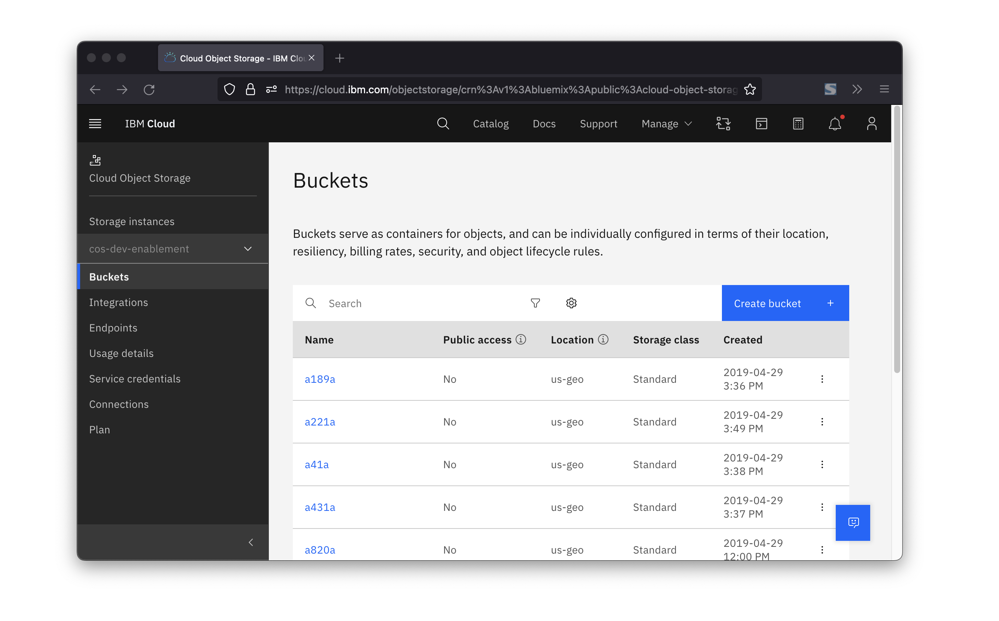
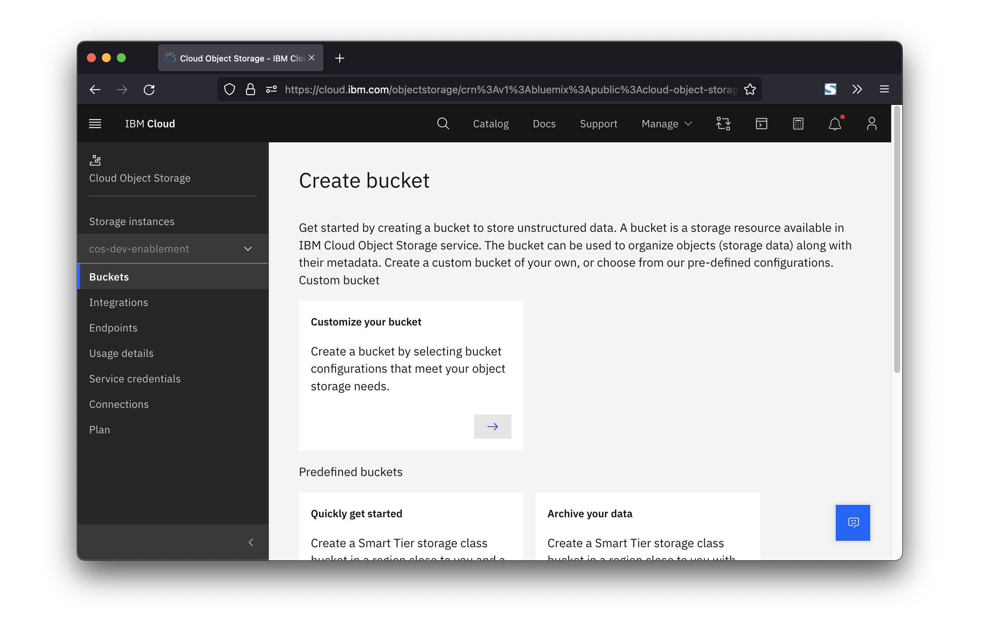
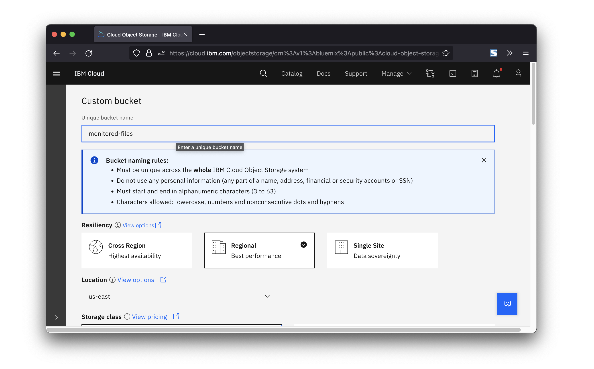
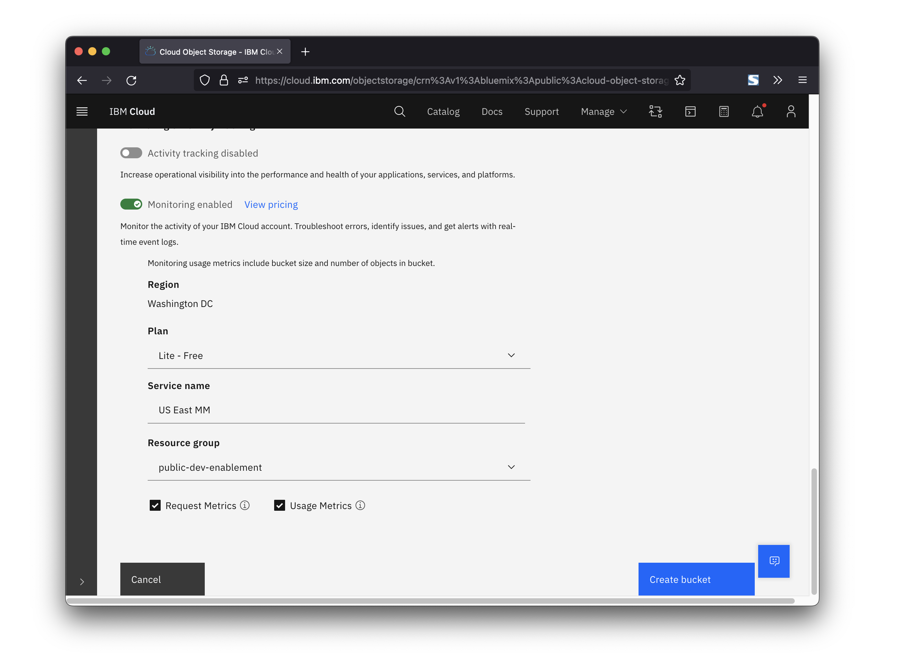
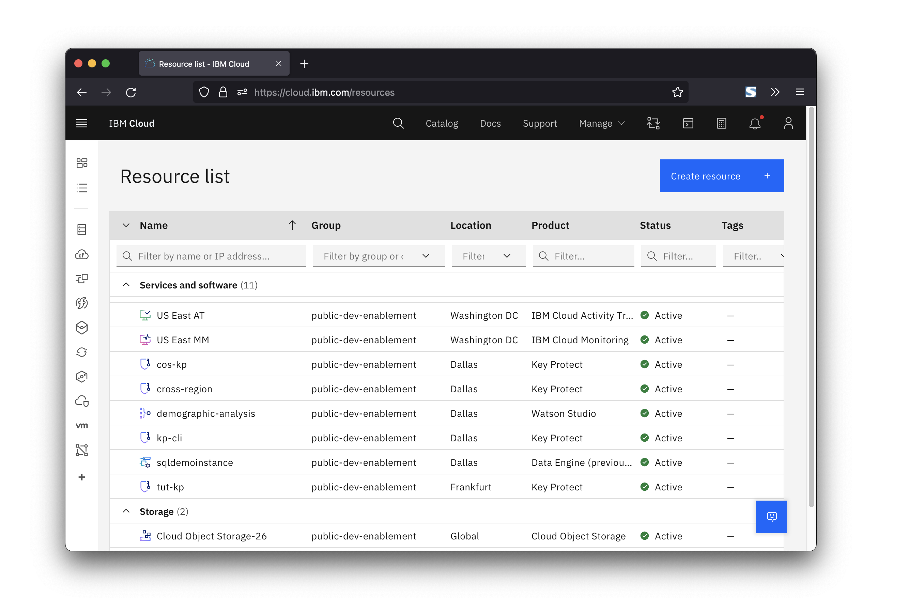

---

copyright:
  years: 2019, 2023
lastupdated: "2023-10-27"

keywords: metrics, monitoring, object storage, tutorial

subcollection: cloud-object-storage

content-type: tutorial
account-plan: lite
completion-time: 30m

---

{{site.data.keyword.attribute-definition-list}}

# Monitoring {{site.data.keyword.cos_short}} activity in {{site.data.keyword.mon_short}}
{: #monitoring-cos}
{: toc-content-type="tutorial"}
{: toc-completion-time="30m"}

Tracking {{site.data.keyword.cos_full}} events with {{site.data.keyword.at_full}} provides insights and information about what is happening with your data.
{: shortdesc}

This tutorial provides an introduction to finding usage information regarding your {{site.data.keyword.cos_short}} instance using {{site.data.keyword.mon_short}}.

If you're not familiar with {{site.data.keyword.cos_full}}, you can quickly get an overview by [getting started with {{site.data.keyword.cos_full_notm}}](/docs/cloud-object-storage?topic=cloud-object-storage-getting-started-cloud-object-storage). Also, if you're not familiar with {{site.data.keyword.mon_full}}, you may wish to see [Using IBM Cloud Monitoring with IBM Cloud Storage {{site.data.keyword.mon_short}}](/docs/cloud-object-storage?topic=cloud-object-storage-mm-cos-integration).

## Before you begin
{: #monitor-cos-prereqs}

If you are already managing instances of {{site.data.keyword.cos_short}} or {{site.data.keyword.mon_short}}, you do not need to create more. However, as this tutorial will modify and configure the instance we are working with, make sure that any accounts or services are not being used in a production environment.

This tutorial will create a new bucket and a new instance of {{site.data.keyword.mon_short}} in the process.  It is, of course, possible to associate an new or existing instance of {{site.data.keyword.mon_short}} with an existing bucket through the bucket's configuration panel, but we'll start fresh in this case.

For this tutorial, you need:
- An [{{site.data.keyword.cloud}} Platform account](https://cloud.ibm.com){: external}
- An [instance of IBM Cloud Object Storage](http://cloud.ibm.com/catalog/services/cloud-object-storage)
- To complete the steps to manage access to the service, your user ID needs **administrator platform permissions** to manage the {{site.data.keyword.at_full_notm}} service. You may have to contact a account administrator. The account owner can grant another user access to the account for the purposes of managing user access, and managing account resources. [Learn more](/docs/account?topic=account-userroles).
- Your user ID needs to be configured with the **service access writer role** at a minimum to create and manipulate buckets.

When naming buckets or objects, be sure to avoid the use of Personally Identifiable Information (PII). PII is information that can identify any user (natural person) by name, location, or any other means.
{: note}

## Create a new bucket
{: #mon-tut-create-bucket}
{: step}

Navigate to your {{site.data.keyword.cos_short}} instance, and click on the **Create bucket** button.

## Create a custom bucket
{: #mon-tut-custom-bucket}
{: step}

We're going to want to create a custom bucket in order to provision our new {{site.data.keyword.mon_short}} instance, so click on the **Customize your bucket** tile.

## Name the new bucket
{: #mon-tut-name-bucket}
{: step}

Give the bucket a memorable name.  In this case the new bucket will be called `monitored-files` and it's being created in the `us-east` region.

## Add {{site.data.keyword.mon_short}}
{: #mon-tut-add-at}
{: step}

Scroll down to the **Monitoring and activity tracking** section and toggle the radio button to **Enable metrics monitoring**.  Select an appropriate plan, and give the new instance a memorable name.  In this case, we're creating the instance in the same region as the bucket (`us-east`) so we'll name the instance `US East MM` so that we can easily find it later.

Enable monitoring for both usage and request metrics.

## Find the new instance of {{site.data.keyword.mon_short}}
{: #mon-tut-find-at}
{: step}

Navigate back to the dashboard, and look for the new instance. Click on it to open the {{site.data.keyword.mon_short}} console.

## Launch the {{site.data.keyword.mon_short}} interface
{: #mon-tut-open-at}
{: step}

Now we can see some metadata about our new {{site.data.keyword.mon_short}} instance (location, CRN, etc.).  Click on the *View IBM Cloud Monitoring** button to launch the interface.

We'll quickly see that there's nothing here.  It will take a little while for the new instance to be associated with the bucket - while data operations (like reading or writing objects) are immediately consistent, operations that update the bucket's metadata (such as adding an {{site.data.keyword.mon_short}} association) are eventually consistent and may take 15 minutes or so to propagate across the system.

## Next steps
{: #mon-tut-next-steps}

Congratulations, you've just set up a bucket with {{site.data.keyword.mon_short}} enabled. Next, learn more about [how the {{site.data.keyword.mon_short}} service itself routes events](/docs/activity-tracker?topic=activity-tracker-getting-started-routing), all of [the various events that {{site.data.keyword.cos_short}} can generate](/docs/cloud-object-storage?topic=cloud-object-storage-at-events), or how to integrate all of this to [provide end-to-end security for a cloud application](/docs/solution-tutorials?topic=solution-tutorials-cloud-e2e-security).
