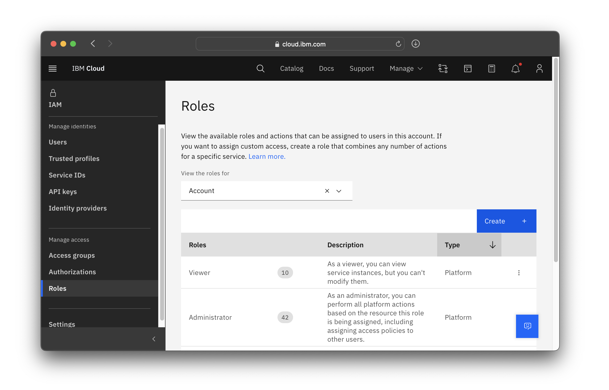
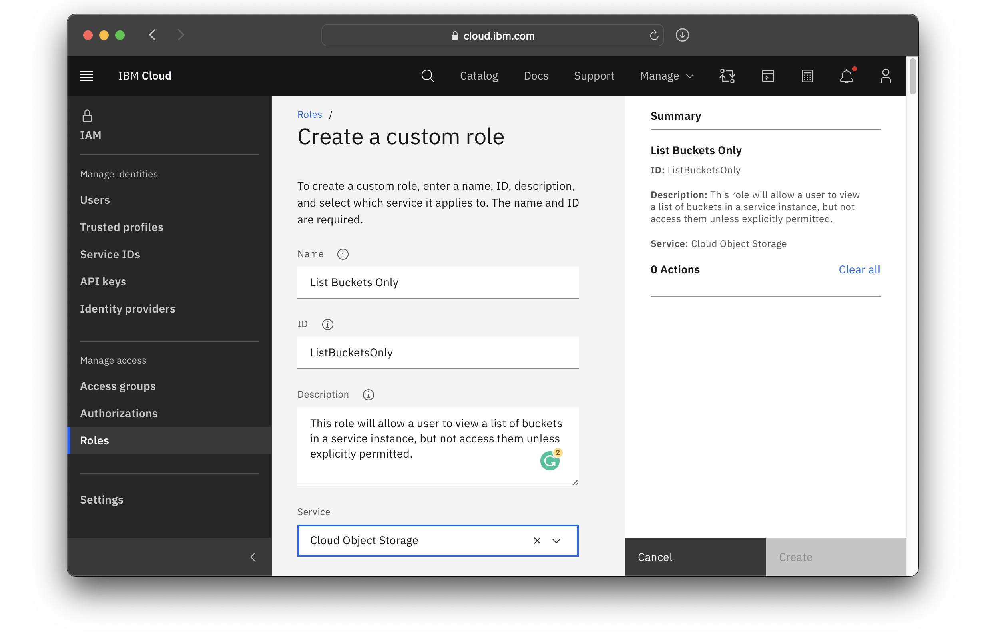
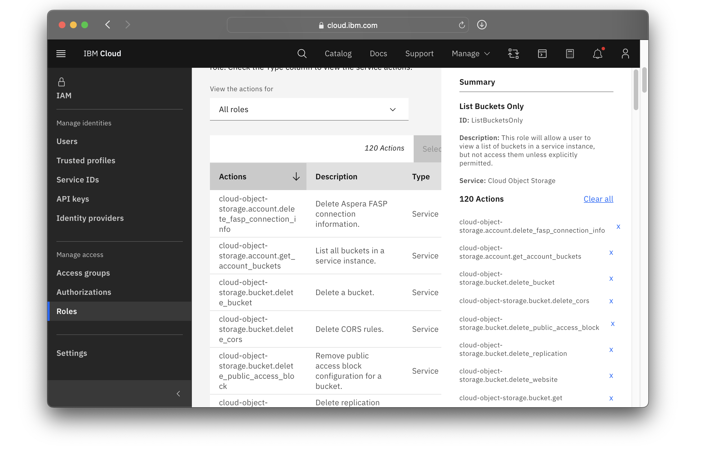
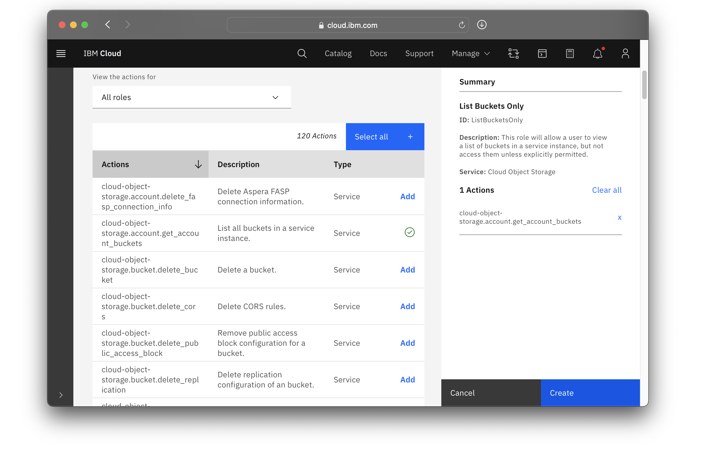
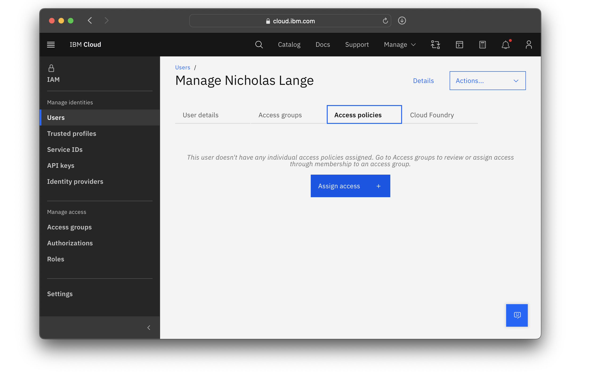
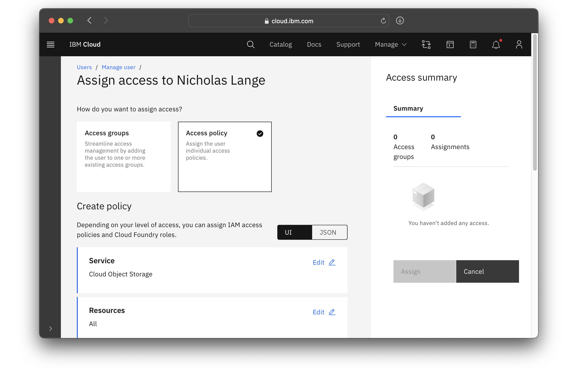
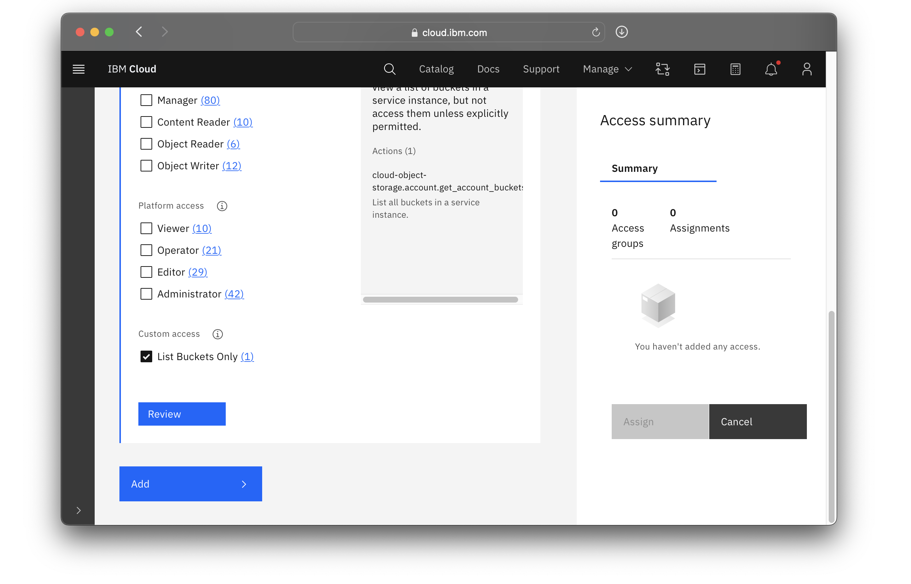
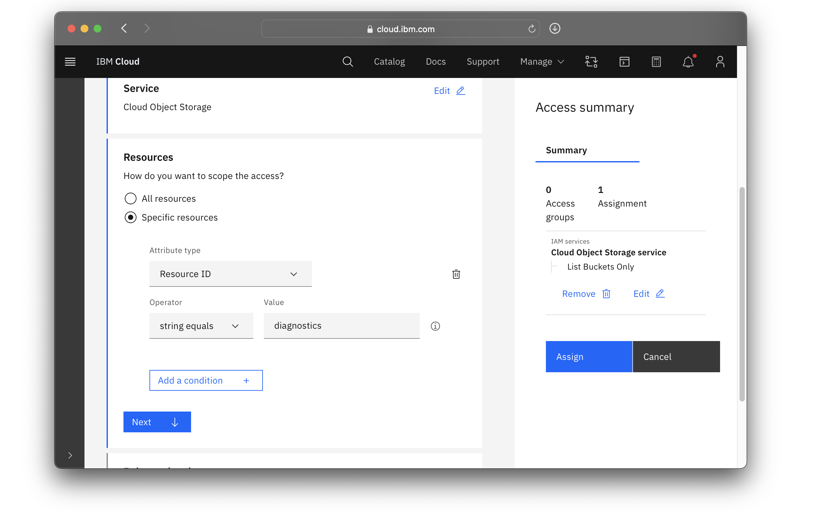
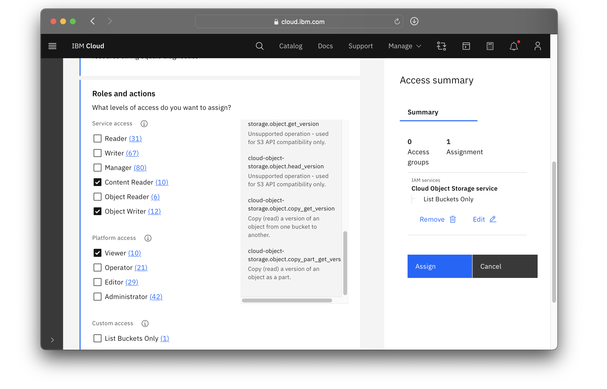

---

copyright:
  years: 2023
lastupdated: "2023-06-14"

keywords: object storage, tutorial, secure stored content, store, content, secure

subcollection: cloud-object-storage

content-type: tutorial
account-plan: lite
completion-time: 15m

---

{{site.data.keyword.attribute-definition-list}}

# Store content securely with {{site.data.keyword.cos_short}}
{: #secure-content-store}
{: toc-content-type="tutorial"}
{: toc-completion-time="15m"}

Are you looking to store content securely (locally or globally) at an affordable cost​, for things like **cloud native apps**, **media storage**, **backup storage** and **archive data**? IBM Secure Content Store with {{site.data.keyword.cos_full}} provides agility in supporting fast, highly consistent deployment across locations for business-critical data, immutable storage, immutable backup, and archive data with industry-leading security and controls for regulatory/compliance requirements​.

- Gain security and control over your data with encryption options, governance policies, access permissions, and context-based restrictions​.
- Have immediate consistency across regions or locations for cloud-native apps, disaster recovery, storage backup, video content and delivery. etc. ​
- Leverage your own encryption keys (BYOK) with Key Protect
- Monitor and retain your account & data activity with Activity Tracker and IBM Monitoring
- APIs & SDKs, Static Web Hosting, High Speed Transfer, Tagging, Replication

## Promotion for new customers!
{: #promotion}

IBM Cloud is offering a $500 promotional credit to quickly get started with our Secure Content Store with {{site.data.keyword.cos_short}}. The credit has a duration of 90 days against your metered consumption of {{site.data.keyword.cos_short}}. See instructions below for applying your promo code. To qualify for this offer you must be a new paid user of {{site.data.keyword.cos_short}}.
IBM Cloud IAM resource groups and access groups allow administrators to restrict users access to various service instances, but what if a user needs to only access a limited number of buckets within a service instance? This can be accomplished using a custom role and a narrowly tailored IAM policy.
{: promotion}

## Overview
{: #overview-secure-stored-content}

This tutorial is for customers looking to set up a Secure Content Store using {{site.data.keyword.cos_short}}, Activity Tracker, and Key Protect. In this tutorial, you are guided through the process of quickly getting started with these essential services to ensure the security and integrity of your content. Secure Content Store is comprised of the following services:

- {{site.data.keyword.cos_short}}: a scalable and flexible storage solution that allows you to store and manage your data securely.
- Activity Tracker: a powerful tool that provides comprehensive visibility into the activities happening within your IBM Cloud environment and allows for ease of audit observability.
- Monitoring: to provide insights and information about what is happening with your data in your Secure Content Store.
- Key Protect: a Key Management Service that enables you to manage and protect your encryption keys in a secure and centralized manner.

Throughout the tutorial, you are provided with step-by-step instructions, along with helpful tips and best practices, which help you set up a Secure Content Store efficiently. So, let's get started!

### High level steps for the tutorial
{: #high-level-steps}
{: steps}

1. Set up {{site.data.keyword.cos_short}} to store and manage your data securely.
2. Configure Activity Tracker for audit observability of relevant events.
3. Add Monitoring for insights and information about what is happening with your data.
4. Finally, use Key Protect to manage encryption keys to secure your data stored in {{site.data.keyword.cos_short}}.

If you're not familiar with {{site.data.keyword.cos_full}}, you can quickly get an overview by [getting started with {{site.data.keyword.cos_full_notm}}](/docs/cloud-object-storage?topic=cloud-object-storage-getting-started-cloud-object-storage). Also, if you're not familiar with IAM, you may wish to check out how to [get started with IAM](/docs/account?topic=account-iamoverview#iamoverview).

## Before you begin
{: #secure-content-prereqs}

For this tutorial, you need:
- An [{{site.data.keyword.cloud}} Platform account](https://cloud.ibm.com){: external}
- An [instance of IBM Cloud Object Storage](http://cloud.ibm.com/catalog/services/cloud-object-storage) (must be a paid Standard Plan instance)

Apply the applicable promotional code that is included below.

IBM Cloud is offering a $500 promotional credit to quickly get started with our Secure Content Store with IBM Cloud Object Storage. The credit has a duration of 90 days against your metered consumption of Cloud Object Storage. To qualify for this offer you must be a new paid user of Cloud Object Storage.
{: promotion}

1. Create or log into a IBM Cloud Paygo, Subscription account.
2. Within IBM Cloud console click **Manage** then **Billing & Usage** from the drop-down list.
3. Select **Promotions and Credits** from the navigation bar on the left.
4. Click **Apply a promo code**.
5. Enter **Promo Code SECUREDCS**, click **verify** and then apply.

## Create a new Object Storage bucket
{: #create-cos-bucket}

1. Navigate to your [instance of IBM Cloud Object Storage](http://cloud.ibm.com/catalog/services/cloud-object-storage).
2. Click Create bucket.

Select Customize your bucket.

Name the new bucket.

Choose your desired region and storage class, based on your activity (hot, cold, variable, etc.)

Using storage classes | IBM Cloud Docs

Add the following services during bucket creation.

Activity Tracker

Scroll down to the Monitoring and activity tracking section and toggle the radio button to Enable activity tracking. Select an appropriate plan, and give the new instance a memorable name. As you may likely want to create the Activity Tracker instance in the same region as the bucket (e.g. us-east) you could name the instance something like “US East AT” so that you can easily find it later.

Track data events for both reading and writing.

Monitoring

Scroll down to the Monitoring and activity tracking section and toggle the radio button to Enable metrics monitoring. Select an appropriate plan, and give the new instance a memorable name. For example, if you are creating the instance in the same region as the bucket (e.g. us-east) you could name the instance “US East MM” so that you can easily find it later.

Enable monitoring for both usage and request metrics.

Key Protect

Scroll down to Service integrations (optional), toggle Key management disabled to enable encryption key management and click on Create new instance.

Choose a region that corresponds with the bucket, give it a memorable name, and click Create and continue.

Give the root key a name and click Create and continue.

3. Verify the information is correct.

4. Click Create bucket.

You are now ready to store data in a secure content store with encryption, monitoring, and audit observability! 

Get started by uploading data

Upload data | IBM Cloud Docs

`

Add additional capabilities to protect from ransomware and accidental deletion such as versioning and immutable retention polices for supporting immutable storage and immutable backup and archive data. 

Locking objects | IBM Cloud Docs

Versioning objects | IBM Cloud Docs

Check out the IBM Cloud Tutorials library for additional tutorials for deploying solutions with Cloud Object Storage. 

IBM Cloud Docs | Tutorial library | Cloud Object Storage

If you are already managing instances of {{site.data.keyword.cos_short}} or IAM, you do not need to create more. However, as this tutorial will modify and configure the instance we are working with, make sure that any accounts or services are not being used in a production environment. 

This tutorial will create a new access policy and a new custom role in the process. 

For this tutorial, you need:
- An [{{site.data.keyword.cloud}} Platform account](https://cloud.ibm.com){: external}
- An [instance of IBM Cloud Object Storage](http://cloud.ibm.com/catalog/services/cloud-object-storage)
- A bucket to which a user should be constrained
- To complete the steps to manage access to the service, your user ID needs **administrator platform permissions** to use the IAM service. You may have to contact or work with an account administrator. 

## Create a custom role 
{: #single-bucket-create-role}
{: step}

First, we need to create a role that allows a user to view a list of buckets, but not to access them or be able to create new buckets.

1. Navigate to IAM by following the **Manage** drop-down menu, and selecting **Access (IAM)**.
2. Select **Roles** from the navigation menu.
3. Click the **Create** button to create a new role.

  {: caption="Figure 1: Creating a custom role."}

4. We can call this role "List Buckets Only".  Give it a name, ID, and brief description, and then select **Cloud Object Storage** from the drop down.

  

5. Scroll down until you see the list of actions.  Click **Clear all** to remove all actions from the new role.
   
   

6. Look for the `cloud-object-storage.account.get_account_buckets` action and click **Add**.

  

7. Click **Create** to finish creating the custom role.

## Create a new user access policy 
{: #single-bucket-create-policy}
{: step}

Now that we have our new role, we can apply it to a user.

1. Follow the **Users** link in the navigation menu, and select the user requiring limited access.
2. Click on the **Assign access** button.

  

3. Select the **Access policy** tile and select **Cloud Object Storage**.

  

4. Scroll down and assign the new role by checking the box next to **List Buckets Only**.
5. Click **Add**.

  

6. Repeat step 3, but this time we'll limit the scope.  Select the radio toggle next to **Specific resources**.
7. Select **Resource ID** from the _Attribute type_ drop-down menu.
8. Type in the name of the bucket that the user should be able to access in the _Value_ field.  In this case, it's a bucket called `diagnostics`. 

  

9.  In the _Roles and access_ section, select the roles **Content Reader** and **Object Writer** roles.  You'll also need the Platform **Viewer** role, if you don't already have it, in order to view the UI.

  

## Next steps
{: #single-bucket-next-steps}

Congratulations, you've just set up a policy to limit access to a single bucket. 
