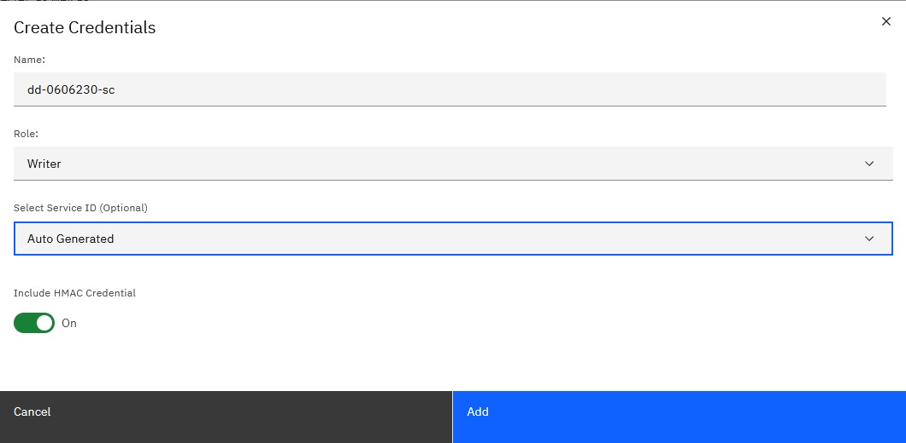

---

copyright:
  years: 2017, 2024
lastupdated: "2024-05-08"

keywords: authorization, aws, hmac, signature

subcollection: cloud-object-storage

---

{{site.data.keyword.attribute-definition-list}}

# Using HMAC credentials
{: #uhc-hmac-credentials-main}

HMAC credentials consist of an Access Key and Secret Key paired for use with S3-compatible tools and libraries that require authentication.
{: shortdesc}

## HMAC credentials defined
{: #uhc-hmac-credentials-defined}

The {{site.data.keyword.cos_full}} API is a REST-based API for reading and writing objects. It uses {{site.data.keyword.iamlong}} for authentication and authorization, and supports a subset of the S3 API for easy migration of applications to {{site.data.keyword.cloud_notm}}.

### Create HMAC credentials in the console
{: #uhc-create-hmac-credentials-console}

Users can create a set of HMAC credentials as part of a [Service Credential](/docs/cloud-object-storage?topic=cloud-object-storage-service-credentials) by switching the `Include HMAC Credential` to `On`  during credential creation in the console. Figure 1 shows the option for setting the HMAC parameter by choosing "Advanced options."

{: caption="HMAC setting from advanced options"}

After the Service Credential is created, the HMAC Key is included in the `cos_hmac_keys` field. These HMAC keys are then associated with a [Service ID](/docs/account?topic=account-serviceids#serviceids) and can be used to access any resources or operations that are allowed by the Service ID's role.

When creating a service credential, it is possible to provide a value of `None` for the role.  This will prevent the creation of unintended or unnecessary IAM access policies. Any access policies for the associated service ID will need to be managed using the IAM console or APIs.
{: tip}

### Create HMAC credentials using the CLI
{: #uhc-create-hmac-credentials-cli}

You can also use the {{site.data.keyword.cos_full}} CLI to create your credentials. You must have the already installed the [{{site.data.keyword.cloud_notm}} Platform Command Line Instructions](/docs/cli?topic=cli-install-ibmcloud-cli) before you can use the example.

```sh
ibmcloud resource service-key-create <key-name-without-spaces> Writer --instance-name "<instance name--use quotes if your instance name has spaces>" --parameters '{"HMAC":true}'
```
{: pre}

## An example of HMAC credentials
{: #uhc-example-hmac-credentials}

If you want to store the results of the generated key, you can append ` > file.skey` to the end of the example. For the purposes of this instruction set, you need only find the `cos_hmac_keys` heading with child keys, `access_key_id`, and `secret_access_key`.

```sh
    cos_hmac_keys:
        access_key_id:      7exampledonotusea6440da12685eee02
        secret_access_key:  8not8ed850cddbece407exampledonotuse43r2d2586
```
{: screen}

### Setting HMAC credentials as environment variables
{: #uhc-setting-hmac-credentials}

Once you have created your credentials, you can set them as environment variables (the instructions for which are specific to the operating system involved). For instance, in Example 3, a `.bash_profile` script contains `COS_HMAC_ACCESS_KEY_ID` and `COS_HMAC_SECRET_ACCESS_KEY` that is exported upon starting a shell and used in development.

```sh
export COS_HMAC_ACCESS_KEY_ID="7exampledonotusea6440da12685eee02"
export COS_HMAC_SECRET_ACCESS_KEY="8not8ed850cddbece407exampledonotuse43r2d2586"

```
{: pre}

## Next steps
{: #uhc-next-steps}

Note that when using HMAC credentials to create signatures to use with direct [REST API](/docs/cloud-object-storage?topic=cloud-object-storage-compatibility-api-bucket-operations#bucket-operations-hmac) calls that extra headers are required:
1. All requests must have an `x-amz-date` header with the date in `%Y%m%dT%H%M%SZ` format.
1. Any request that has a payload (object uploads, deleting several objects, and so on) must provide a `x-amz-content-sha256` header with an SHA256 hash of the payload contents.
1. ACLs (other than `public-read`) are unsupported.

Not all S3-compatible tools are currently supported. Some tools attempt to set ACLs other than `public-read` on bucket creation. Bucket creation through these tools will fail. If a `PUT bucket` request fails with an unsupported ACL error, first use the console as shown in the [getting started with {{site.data.keyword.cos_full_notm}}](/docs/cloud-object-storage?topic=cloud-object-storage-getting-started-cloud-object-storage) to create the bucket, then configure the tool to read and write objects to that bucket. Tools that set ACLs on object writes are not currently supported.
{: tip}
