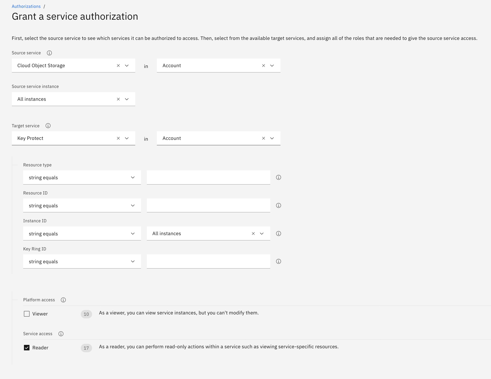

---

copyright:
  years: 2018, 2025
lastupdated: "2025-02-18"

keywords: encryption, security, sse-c, key protect

subcollection: cloud-object-storage

---

{{site.data.keyword.attribute-definition-list}}

{:help: data-hd-content-type='help'}

# Server-Side Encryption with {{site.data.keyword.keymanagementservicelong_notm}} (SSE-KP)
{: #kp}

You can use [IBM Key Protect](/docs/key-protect?topic=key-protect-about) to create, add, and manage keys, which you can then associate with your instance of IBM® Cloud Object Storage to encrypt buckets.

## Before you begin
{: #kp-begin}
Before you plan on using Key Protect with Cloud Object Storage buckets, you need:

- An [IBM Cloud™ Platform account](http://cloud.ibm.com/)
- An [instance of IBM Cloud Object Storage](/objectstorage/create)

You will also need to ensure that a service instance is created by using the [IBM Cloud catalog](https://cloud.ibm.com/catalog) and appropriate permissions are granted. This section outlines step-by-step instructions to help you get started.

## Provisioning an instance of IBM Key Protect
{: #kp-provision}
Refer to the service-specific product pages for instructions on how to provision and setup appropriate service instances.

- Getting started with [IBM Key Protect](/docs/key-protect?topic=key-protect-getting-started-tutorial#getting-started-tutorial)

As of 1 January 2025, five key versions per account are no longer free. You are charged for each key version, starting with the first created key.
{: important}

Once you have an instance of Key Protect, you need to create a root key and note the CRN ([Cloud Resource Name](/docs/account?topic=account-crn)) of that key. The CRN is sent in a header during bucket creation.

Before creating the bucket for use with Key Protect, review the [relevant guidance around availability and disaster recovery](/docs/key-protect?key-protect-ha-dr).

Note that managed encryption for a Cross Region bucket **must** use a root key from a Key Protect instance in the nearest [high-availability location](/docs/key-protect?topic=key-protect-ha-dr) (`us-south`, `eu-de`, or `jp-tok`).
{: important}

## Create or add a key in Key Protect
{: #kp-create}

Navigate to your instance of Key Protect and [generate or enter a root key](/docs/key-protect?topic=key-protect-getting-started-tutorial).

## Grant service authorization
{: #kp-sa}

Authorize Key Protect for use with IBM COS:

1. Open your IBM Cloud dashboard.
2. From the menu bar, click **Manage > Access (IAM)**.
3. In the side navigation, click **Authorizations**.
4. Click **Create authorization**.
5. In the **Source service** menu, select **Cloud Object Storage**.
6. In the **Source service instance** menu, select the service instance to authorize.
7. In the **Target service** menu, select **IBM Key Protect**.
   {: caption="Figure 1: Grant service authorization for Key Protect."}
8. In the **Target service instance** menu, select the service instance to authorize. The additional fields may be left blank.
9. Enable the **Reader** role.
10. Click **Authorize**.

## Create a bucket
{: #kp-bucket}

When your key exists in Key Protect and you authorized the service for use with IBM COS, associate the key with a new bucket:

1. Navigate to your instance of Object Storage.
1. Click **Create bucket**.
1. Select **Custom bucket**.
1. Enter a bucket name, select the **Regional** resiliency, and choose a location and storage class.
1. In **Service integrations**, toggle **Key management disabled** to enable encryption key management and click on **Use existing instance**.
1. Select the associated service instance and key, and click **Associate key**.
1. Verify the information is correct.
1. Click **Create**.

You can choose to use Key Protect to manage encryption for a bucket only at the time of creation. It isn't possible to change an existing bucket to use Key Protect.
{: important}

If bucket creation fails with a `400 Bad Request` error with the message `The Key CRN could not be found`, ensure that the CRN is correct and that the service to service authorization policy exists.
{:tip}

In the **Buckets** listing, the bucket has a _View_ link under **Attributes** where you can verify that the bucket has a Key Protect key enabled.

Note that the `Etag` value returned for objects encrypted using SSE-KP **will** be the actual MD5 hash of the original decrypted object.
{:tip}

It is also possible to use [the REST API](/docs/cloud-object-storage?topic=cloud-object-storage-compatibility-api-bucket-operations#compatibility-api-key-protect) or SDKs ([Go](/docs/cloud-object-storage?topic=cloud-object-storage-using-go#go-examples-kp), [Java](/docs/cloud-object-storage?topic=cloud-object-storage-java#java-examples-kp), [Node.js](/docs/cloud-object-storage?topic=cloud-object-storage-node#node-examples-kp), or [Python](/docs/cloud-object-storage?topic=cloud-object-storage-python#python-examples-kp)).

## Key lifecycle management
{: #kp-lifecycle}

Key Protect offers various ways to manage the lifecycle of encryption keys.  For more details, see [the Key Protect documentation](/docs/key-protect?topic=key-protect-key-states).

### Rotating Keys
{: #kp-rotate}

Key rotation is an important part of mitigating the risk of a data breach. Periodically changing keys reduces the potential data loss if the key is lost or compromised. The frequency of key rotations varies by organization and depends on a number of variables, such as the environment, the amount of encrypted data, classification of the data, and compliance laws. The [National Institute of Standards and Technology (NIST)](https://www.nist.gov/cryptography){: external} provides definitions of appropriate key lengths and provides guidelines for how long keys should be used.

For more information, see the documentation for rotating keys in [Key Protect](/docs/key-protect?topic=key-protect-set-rotation-policy).

### Disabling and re-enabling keys
{: #kp-disable}

As an admin, you might need to [temporarily disable a root key](/docs/key-protect?topic=key-protect-disable-keys) if you suspect a possible security exposure, compromise, or breach with your data. When you disable a root key, you suspend its encrypt and decrypt operations. After confirming that a security risk is no longer active, you can reestablish access to your data by enabling the disabled root key.

If a key is disabled, and then re-enabled quickly, requests made to that bucket may be rejected for up to an hour before cached key information is refreshed.
{: note}

### Deleting keys and cryptographic erasure
{: #kp-cryptoerasure}

It isn't possible to delete a root key associated with a bucket that has a [retention policy](/docs/cloud-object-storage?topic=cloud-object-storage-immutable) in place.  The bucket must be first emptied and destroyed before the root key can be deleted. For more information, [see the Key Protect documentation](/docs/key-protect?topic=key-protect-delete-purge-keys#delete-purge-keys-considerations).
{: important}

Cryptographic erasure (or crypto-shredding) is a method of rendering encrypted data  unreadable by [deleting the encryption keys](/docs/key-protect?topic=key-protect-security-and-compliance#data-deletion) rather than the data itself. When a [root key is deleted in Key Protect](/docs/key-protect?topic=key-protect-delete-keys), it will affect all objects in any buckets created using that root key, effectively "shredding" the data and preventing any further reading or writing to the buckets. This process is not instantaneous, but occurs within about 90 seconds after the key is deleted.

Although objects in a crypto-shredded bucket can not be read, and new object can not be written, existing objects will continue to consume storage until they are deleted by a user.
{: tip}

### Restoring a deleted key
{: #kp-restore}

As an admin, you might need to [restore a root key that you imported](/docs/key-protect?topic=key-protect-restore-keys) to Key Protect so that you can access data that the key previously protected. When you restore a key, you move the key from the Destroyed to the Active key state, and you restore access to any data that was previously encrypted with the key. This must occur within 30 days of deleting a key.

## Activity Tracking
{: #kp-at}

When Key Protect root keys are deleted, rotated, suspended, enabled, or restored, an [Activity Tracker management event](/docs/cloud-object-storage?topic=cloud-object-storage-at-events#at-actions-global) (`cloud-object-storage.bucket-key-state.update`) is generated in addition to any events logged by Key Protect. 

In the event of a server-side failure in a lifecycle action on a key, that failure is not logged by COS.  If Key Protect does not receive a success from COS for the event handling within four hours of the event being sent, Key Protect will log a failure.
{: note}

The `cloud-object-storage.bucket-key-state.update` actions are triggered by events taking place in Key Protect, and require that the bucket is registered with the Key Protect service.  This registration happens automatically when a bucket is created with a Key Protect root key.

Buckets created prior to February 26th, 2020 are not registered with the Key Protect service and will not receive notifications of encryption key lifecycle events at this time. These buckets can be identified by performing [a bucket listing operation](/docs/cloud-object-storage?topic=cloud-object-storage-compatibility-api-bucket-operations#compatibility-api-list-buckets) and looking at the dates for bucket creation. To ensure that these buckets have the latest key state from Key Protect, it is recommended that [some data operation is performed](/docs/cloud-object-storage?topic=cloud-object-storage-object-operations#object-operations-head), such as a `PUT`, `GET`, or `HEAD` on an object in each affected bucket.  It is recommended that an object operation is done twice, at least an hour apart, to ensure that the key state is properly in synchronization with the Key Protect state.
{: important}

For more information on Activity Tracker events for object storage, [see the reference topic](/docs/cloud-object-storage?topic=cloud-object-storage-at-events).
