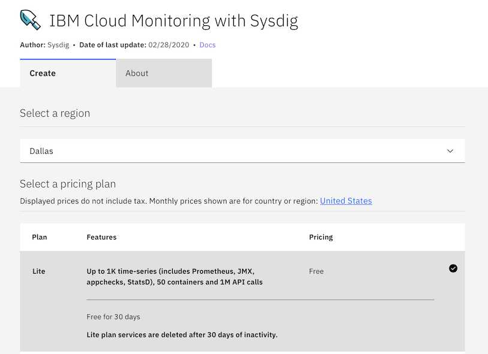
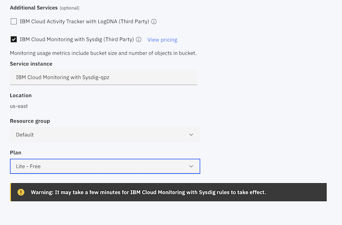
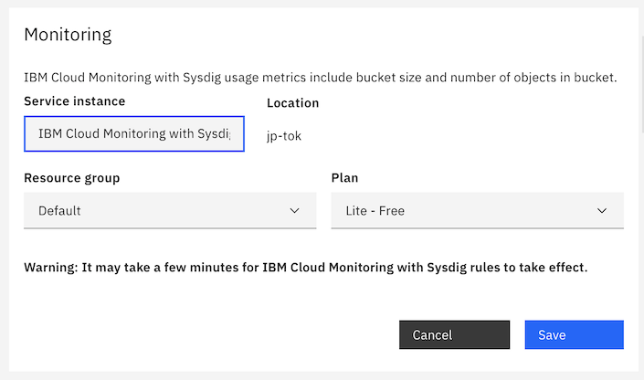
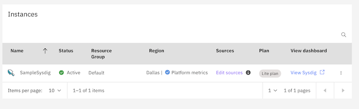
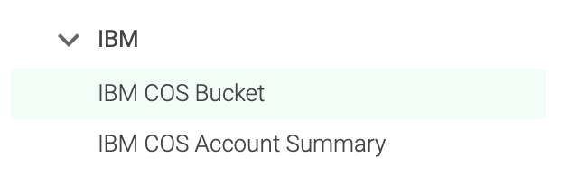
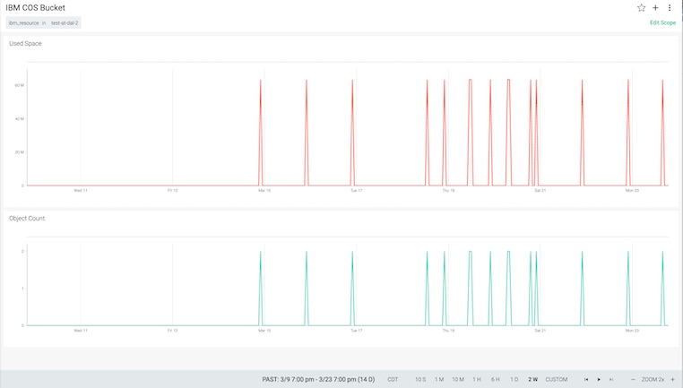
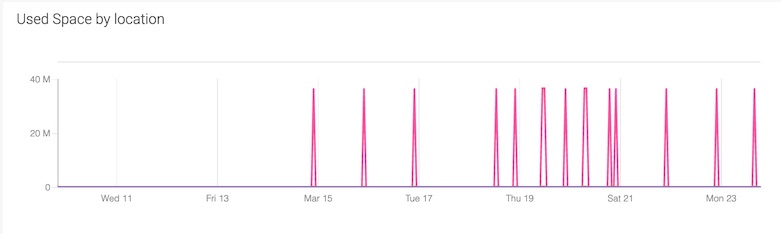
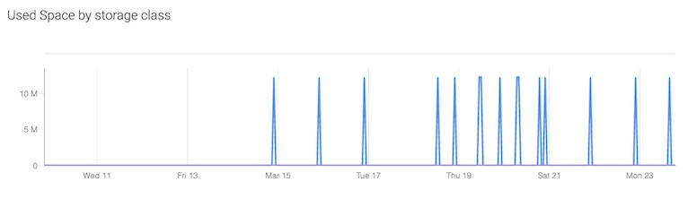

---

copyright:
  years: 2020, 2024
lastupdated: "2024-05-08"

keywords: Object Storage, SysDig, monitoring, integration

subcollection: cloud-object-storage

---

{{site.data.keyword.attribute-definition-list}}
{:http: .ph data-hd-programlang='http'}
{:console: .ph data-hd-programlang='Console'}
{:cli: .ph data-hd-programlang='CLI'}

# Configure Metrics for IBM Cloud Object Storage Using {{site.data.keyword.mon_full_notm}}
{: #mm-cos-integration}

Configure Metrics for IBM Cloud Object Storage

Use the IBM Cloud® Monitoring service to monitor your IBM Cloud® Object Storage (COS) data. IBM Cloud Monitoring is a cloud-native management system. The metrics produced by your COS buckets can be displayed in dashboards built in IBM Monitoring. Documentation from Monitoring can guide you in how to use the comprehensive dashboards. Additionally, specify the conditions when a metrics alert is trigged to set notifications when custom thresholds are exceeded.

Metrics monitoring can be enabled on your bucket via the Resource Configuration API or through the UI directly. This can be done during bucket provisioning for afterwards by updating the bucket configuration.

IBM COS supports enabling metrics tracking on the following types of metrics:

Usage Metrics – These are metrics related to the overall usage of your COS bucket such as total storage consumed in bytes. 

Request Metrics – The metrics report the counts for certain types of API requests made to your bucket

See the Cloud Object Storage metrics details section below for the full list of metrics that can be sent to IBM Monitoring. 

Route Logs with IBM Cloud Metrics Routing

Use IBM Cloud® Metrics Routing to configure how to route metrics for your IBM Cloud Object Storage resources. You can use Metrics Routing, a platform service, to manage targets and routes that define where metrics data is routed.

When enabling monitoring on your IBM COS buckets, metrics are sent to a default receiving location as defined in COS Service Integration. You must have an instance of IBM Monitoring at this location, or configure a routing rule to another location with a Monitoring instance, to ensure metrics are received.

See Getting started with IBM Cloud Metrics Routing to learn more


Configure Metrics on your IBM Cloud Object Storage Bucket (Recommended)

Metrics tracking can be enabled on your IBM Cloud Object Storage bucket at the time of bucket provisioning or by updating the bucket configuration after bucket creation. Metrics monitoring will only apply to COS metrics produced after enablement.

Note: This feature is not currently supported in Object Storage for Satellite. Learn more.

Note: This feature supports SCC monitoring

Note: COS metrics can only be consumed by IBM Monitoring platform instances. If a platform instance does not exist at the final receiving location, ensure one is created.

Refer to the COS API events to see the full list of Management, Read Data, and Write Data actions that produce events.

Use the COS Resource Configuration API to configure tracking of these metrics for your bucket

When metrics tracking is enabled, all events will be sent to the default receiving location for IBM Cloud Metrics Router based on the location of the bucket. Refer to IBM COS Service Integration to see this default mapping. Use Metrics Router rules to route events to an alternative location or target service. See Managing Routes to learn more.


Configure Metrics on your IBM Cloud Object Storage Bucket (Legacy)

Enable IBM Metrics Monitoring on your COS bucket by specifying the target CRN of the Monitoring instance in the COS Resource Configuration API. Specify the CRN to define the route for COS metrics

{Note:  IBM Cloud observability routing services are the standardized way for customers to manage routing of platform observability data.  Service-specific routing configurations like COS are being deprecated.

It is recommended that customers remove these legacy routing configurations (make this a link to upgrade section below) that use CRNs and instead use the IBM Metrics Router service to route metrics to other locations.

IBM COS will continue to support legacy configurations where a CRN was specified that differs from the default location.}


Upgrading from Legacy to the Recommended Metrics Monitoring on your COS bucket:

To upgrade from the legacy configuration using the Resource Configuration API, remove the target Metrics Monitoring instance CRN. Metrics will now route to the default Metrics Router receiving location as described in COS Service Integration. Provision an instance of Monitoring at this location or define a routing rule prior to upgrading to ensure there’s no interruption in metrics monitoring.

Cloud Object Storage metrics details

Usage metrics
There are a set of basic metrics that track usage:
•	ibm_cos_bucket_used_bytes
•	ibm_cos_bucket_object_count
•	ibm_cos_bucket_hard_quota_bytes
Request metrics
There are metrics that report the aggregates for different classes of HTTP requests:
•	ibm_cos_bucket_all_requests
•	ibm_cos_bucket_get_requests
•	ibm_cos_bucket_put_requests
•	ibm_cos_bucket_delete_requests
•	ibm_cos_bucket_post_requests
•	ibm_cos_bucket_list_requests
•	ibm_cos_bucket_head_requests
Errors are also collected, with server-side (5xx) errors broken out:
•	ibm_cos_bucket_4xx_errors
•	ibm_cos_bucket_5xx_errors
The minimum, maximum, and average bytes transferred by network type are reported:
•	ibm_cos_bucket_bytes_download_public_min
•	ibm_cos_bucket_bytes_download_public_max
•	ibm_cos_bucket_bytes_download_public_avg
•	ibm_cos_bucket_bytes_download_private_min
•	ibm_cos_bucket_bytes_download_private_max
•	ibm_cos_bucket_bytes_download_private_avg
•	ibm_cos_bucket_bytes_download_direct_min
•	ibm_cos_bucket_bytes_download_direct_max
•	ibm_cos_bucket_bytes_download_direct_avg
•	ibm_cos_bucket_bytes_upload_public_min
•	ibm_cos_bucket_bytes_upload_public_max
•	ibm_cos_bucket_bytes_upload_public_avg
•	ibm_cos_bucket_bytes_upload_private_min
•	ibm_cos_bucket_bytes_upload_private_max
•	ibm_cos_bucket_bytes_upload_private_avg
•	ibm_cos_bucket_bytes_upload_direct_min
•	ibm_cos_bucket_bytes_upload_direct_max
•	ibm_cos_bucket_bytes_upload_direct_avg
Latency metrics (first byte and general) for requests are broken down by request type:
•	ibm_cos_bucket_first_byte_latency_read_min
•	ibm_cos_bucket_first_byte_latency_read_max
•	ibm_cos_bucket_first_byte_latency_read_avg
•	ibm_cos_bucket_first_byte_latency_write_min
•	ibm_cos_bucket_first_byte_latency_write_max
•	ibm_cos_bucket_first_byte_latency_write_avg
•	ibm_cos_bucket_first_byte_latency_misc_min
•	ibm_cos_bucket_first_byte_latency_misc_max
•	ibm_cos_bucket_first_byte_latency_misc_avg
•	ibm_cos_bucket_request_latency_read_min
•	ibm_cos_bucket_request_latency_read_max
•	ibm_cos_bucket_request_latency_read_avg
•	ibm_cos_bucket_request_latency_write_min
•	ibm_cos_bucket_request_latency_write_max
•	ibm_cos_bucket_request_latency_write_avg
•	ibm_cos_bucket_request_latency_misc_min
•	ibm_cos_bucket_request_latency_misc_max
•	ibm_cos_bucket_request_latency_misc_avg
All metrics are reported as float64 numeric values:


Use the {{site.data.keyword.mon_full}} service to monitor your {{site.data.keyword.cos_full}} (COS) data in the {{site.data.keyword.cloud_notm}}. The results of the activity can be measured for compliance and other analysis through the web dashboard UI.
{: shortdesc}

This feature is not currently supported in {{site.data.keyword.cos_short}} for {{site.data.keyword.satelliteshort}}. [Learn more.](/docs/cloud-object-storage?topic=cloud-object-storage-about-cos-satellite)
{: note}

## Features
{: #mm-cos-features}

{{site.data.keyword.mon_full_notm}} is a cloud-native management system. Documentation from [{{site.data.keyword.mon_short}}](/docs/monitoring?topic=monitoring-dashboards) can guide you in how to use the comprehensive dashboards. In this guide we will focus on how to measure activity on individual buckets in your instance of {{site.data.keyword.cos_full_notm}}.

### Working with Metrics
{: #mm-cos-metrics}

According to the [{{site.data.keyword.mon_short}} documentation](/docs/monitoring?topic=monitoring-getting-started#getting-started), "A metric is a quantitative measure that has one or more labels to define its characteristics." When you configure your buckets to forward data to a {{site.data.keyword.mon_short}} instance, that data is automatically collected and available for analysis through the web UI.

## Before you begin
{: #mm-cos-before-starting}

Before you provision an instance of {{site.data.keyword.mon_full_notm}}, consider the following guidance:

* The account owner can create, view, and delete an instance of a service in the {{site.data.keyword.cloud_notm}}. This user can also grant permissions to other users to work with the {{site.data.keyword.mon_full_notm}} service.
* Other {{site.data.keyword.cloud_notm}} users with `administrator` or `editor` permissions can manage the {{site.data.keyword.mon_full_notm}} service in the {{site.data.keyword.cloud_notm}}. These users must also have platform permissions to create resources within the context of the resource group where they plan to provision the instance.

In this guide, we will examine using both the {{site.data.keyword.cloud_notm}} Console as well as the IBM Cloud Developer Tools (CLI) to integrate {{site.data.keyword.mon_short}} in your {{site.data.keyword.cos_short}} instance. For more information about IBM Cloud Developer Tools, check out the [documentation](/docs/cli?topic=cli-getting-started).

Using either set of instructions, Console or CLI, you will be able to get started using this guide. If the instructions that you seek do not appear in this guide, click on the appropriate item using the context switcher.

### Instantiating and Provisioning {{site.data.keyword.cos_full_notm}}
{: #mm-cos-instantiation}

If you have not already done so, [set up and provision](/docs/cloud-object-storage?topic=cloud-object-storage-provision) your instance of {{site.data.keyword.cos_short}}. If you already have an instance of {{site.data.keyword.mon_short}} to work with, verify you have either the `manager` or `writer` [role](/docs/cloud-object-storage?topic=cloud-object-storage-iam-bucket-permissions) to work with this guide.

## Manage User Access
{: #mm-cos-manage-users}

There are many ways to manage access to your {{site.data.keyword.cos_short}} instance, but for this guide we'll focus on how to access the dashboard you are going to create.

**Users in an account [must be assigned a platform role](/docs/account?topic=account-userroles) to manage instances as well as launching the IBM Cloud Monitoring UI from the {{site.data.keyword.cloud_notm}} console. In addition, users must have a service role that defines the permissions to work with {{site.data.keyword.mon_full_notm}}.**
{: important}

## Provisioning an instance of {{site.data.keyword.mon_short}}
{: #mm-cos-provisioning}

From the [catalog](https://cloud.ibm.com/login){: external} choose {{site.data.keyword.mon_full_notm}} from the available services. When selected, you will be taken to the configuration shown in Figure 1.  At the bottom of the screen under "IBM platform metrics:" select Enable before creating the instance. You can use either the console or the CLI to provision a new service instance.
{: console}

{: console}

After you [login](/docs/cli?topic=cli-ibmcloud_cli#ibmcloud_login) using IBM Cloud Developer Tools and target both the region and resource group for your account, create a new resource using the command as shown.

```sh
ibmcloud resource service-instance-create <INSTANCE_NAME> <SERVICE_NAME> <SERVICE_PLAN_NAME> <LOCATION>
```
{: codeblock}

In the code sample, replace the placeholders with the [appropriate values](/docs/monitoring?topic=monitoring-pricing_plans).

| Value	| Description | Sample |
| --- | --- | --- |
| &lt;INSTANCE_NAME&gt; | The name of your new instance | `MyMonitoring` |
| &lt;SERVICE_NAME&gt; | The name of the service | `sysdig-monitor` |
| &lt;SERVICE_PLAN_NAME&gt; | The name of the plan | `Lite` |
| &lt;LOCATION&gt; | The region of your buckets | `us-east` |

```sh
ibmcloud resource service-instance-update <INSTANCE_NAME> -p '{"default_receiver": true}'
```
{: codeblock}

## Connect {{site.data.keyword.cos_short}} to {{site.data.keyword.mon_short}}
{: #mm-cos-connection}

Most of the work you will do with {{site.data.keyword.mon_short}} will be in specific dashboards to be discussed later. But first, there are a couple of ways in which you can get started.

Complete the following steps to get an IAM token:

1. From a terminal, log in to the {{site.data.keyword.cloud_notm}}.

2. Run the following command to get a token:

   ```cli
    ibmcloud iam oauth-tokens
   ```

   {: codeblock}

Keep the token handy for later if you are using the Dev Tools CLI.

### Configure a bucket for metrics
{: #mm-cos-connection-console}

Metrics are only sent to {{site.data.keyword.mon_short}} every 24 hours. Any alert thresholds exceeded on metrics will not trigger until the next time the metrics are sent to {{site.data.keyword.mon_short}}.
{: important}

When creating a bucket, you can configure your {{site.data.keyword.mon_short}} instance at the same time.
{: console}

{: console}

You can also configure an existing bucket to use the {{site.data.keyword.mon_short}} instance by selecting `configuration` in the console.
{: console}

{: console}

Note that in each case the `region` for your new instance of {{site.data.keyword.mon_short}} is automatically tied to the region of the bucket.
{: important}
{: console}

Note that if the {{site.data.keyword.mon_short}} instance is created by COS, Platform metrics must be set on the {{site.data.keyword.mon_short}} instance.
{: important}
{: console}

To set Platform metrics on the instance:
{: console}

   1. Go to your [dashboard](https://cloud.ibm.com/observe/monitoring).
   2. Click on "Configure platform metrics."
   3. Select the region where the {{site.data.keyword.mon_short}} instance was created.
   4. Click "Configure."
   5. Your {{site.data.keyword.mon_short}} instance is now set for Platform metrics.
   {: console}

We will use cURL to connect to the Resource Configuration API and modify our bucket's configuration.

```sh
curl -X PATCH -k  \
  -H "authorization: Bearer $TOKEN" \
  https://config.cloud-object-storage.cloud.ibm.com/v1/b/$1 \
  -H 'cache-control: no-cache' \
  -d '{"metrics_monitoring": {
    "usage_metrics_enabled": true,
    "request_metrics_enabled": true,
    "metrics_monitoring_crn": "crn:v1:bluemix:public:sysdig-monitor:us-east:a/9xxxxxxxxxb1xxxc7fdxxxxxxxxxx5:7xxxxxxxx0-xx7x-xdx8-9fxx-123456789012::"
    }
   }'
```
{: codeblock}


In the code sample, replace the placeholders with the appropriate values.

| Value	| Description |
| --- | --- |
| $TOKEN | The token for authentication created previously |
| $1 | The name of your bucket |

### Launch your instance of {{site.data.keyword.mon_short}}
{: #mm-cos-connection-launch}

When you have created your instance of {{site.data.keyword.mon_short}}, click on the "View Monitoring" button in the "View dashboard" column, as shown in Figure 4.

{: caption="Figure 1. Launching {{site.data.keyword.mon_short}} instances"}

### Choose a pre-built dashboard for {{site.data.keyword.mon_short}}
{: #mm-cos-connection-dashboard}

This guide has skipped right past the installation of agents that is typical of most monitoring configurations. In addition, you can also skip the manual creation of building a dashboard by using a pre-built solution. As shown in Figure 2, you can choose how to present your data using one of the options given.

{: caption="Figure 2. Choose a pre-built report"}

### View your data in {{site.data.keyword.mon_short}}
{: #mm-cos-connection-view-data}

Once you've configured your dashboard, you can view your data. Figures 3-5 show different views of your usage.

{: caption="Figure 3. View sample data showing space used and number of objects"}

{: caption="Figure 4. View space used by location"}

{: caption="Figure 5. View used space by storage class"}

## Cloud Object Storage metrics details
{: #mm-cos-metrics-details}

### Usage metrics
{: #mm-cos-metrics-usage}

There are a set of basic metrics that track usage:

* `ibm_cos_bucket_used_bytes`
* `ibm_cos_bucket_object_count`
* `ibm_cos_bucket_hard_quota_bytes`

### Request metrics
{: #mm-cos-metrics-request}

There are metrics that report the aggregates for different classes of HTTP requests:

* `ibm_cos_bucket_all_requests`
* `ibm_cos_bucket_get_requests`
* `ibm_cos_bucket_put_requests`
* `ibm_cos_bucket_delete_requests`
* `ibm_cos_bucket_post_requests`
* `ibm_cos_bucket_list_requests`
* `ibm_cos_bucket_head_requests`

Errors are also collected, with server-side (5xx) errors broken out:

* `ibm_cos_bucket_4xx_errors`
* `ibm_cos_bucket_5xx_errors`

The minimum, maximum, and average bytes transferred by network type are reported:

* `ibm_cos_bucket_bytes_download_public_min`
* `ibm_cos_bucket_bytes_download_public_max`
* `ibm_cos_bucket_bytes_download_public_avg`
* `ibm_cos_bucket_bytes_download_private_min`
* `ibm_cos_bucket_bytes_download_private_max`
* `ibm_cos_bucket_bytes_download_private_avg`
* `ibm_cos_bucket_bytes_download_direct_min`
* `ibm_cos_bucket_bytes_download_direct_max`
* `ibm_cos_bucket_bytes_download_direct_avg`
* `ibm_cos_bucket_bytes_upload_public_min`
* `ibm_cos_bucket_bytes_upload_public_max`
* `ibm_cos_bucket_bytes_upload_public_avg`
* `ibm_cos_bucket_bytes_upload_private_min`
* `ibm_cos_bucket_bytes_upload_private_max`
* `ibm_cos_bucket_bytes_upload_private_avg`
* `ibm_cos_bucket_bytes_upload_direct_min`
* `ibm_cos_bucket_bytes_upload_direct_max`
* `ibm_cos_bucket_bytes_upload_direct_avg`

Latency metrics (first byte and general) for requests are broken down by request type:

* `ibm_cos_bucket_first_byte_latency_read_min`
* `ibm_cos_bucket_first_byte_latency_read_max`
* `ibm_cos_bucket_first_byte_latency_read_avg`
* `ibm_cos_bucket_first_byte_latency_write_min`
* `ibm_cos_bucket_first_byte_latency_write_max`
* `ibm_cos_bucket_first_byte_latency_write_avg`
* `ibm_cos_bucket_first_byte_latency_misc_min`
* `ibm_cos_bucket_first_byte_latency_misc_max`
* `ibm_cos_bucket_first_byte_latency_misc_avg`
* `ibm_cos_bucket_request_latency_read_min`
* `ibm_cos_bucket_request_latency_read_max`
* `ibm_cos_bucket_request_latency_read_avg`
* `ibm_cos_bucket_request_latency_write_min`
* `ibm_cos_bucket_request_latency_write_max`
* `ibm_cos_bucket_request_latency_write_avg`
* `ibm_cos_bucket_request_latency_misc_min`
* `ibm_cos_bucket_request_latency_misc_max`
* `ibm_cos_bucket_request_latency_misc_avg`

All metrics are reported as `float64` numeric values:

## Attributes for Segmentation
{: #mm-cos-attributes}

You can filter your results by attributes. In this guide, we'll look at some general examples as well as those specific to {{site.data.keyword.cos_full_notm}}.

### Global Attributes
{: #mm-cos-global-attributes}

The following attributes are available for segmenting all the metrics listed above

| Attribute | Attribute Name | Attribute Description |
|-----------|----------------|-----------------------|
| `Cloud Type` | `ibm_ctype` | public, dedicated or local |
| `Location` | `ibm_location` | The location of the monitored resource. This may be a Cross Region, Regional, or Single Site bucket. |
| `Resource` | `ibm_resource` | COS bucket name |
| `Resource Type` | `ibm_resource_type` | COS bucket |
| `Scope` | `ibm_scope` | The scope is the account associated with this metric. |
| `Service name` | `ibm_service_name` | cloud-object-storage |
{: caption="Table 4: IBM global attributes" caption-side="top"}

### Additional Attributes
{: #mm-cos-additional-attributes}

The following attributes are available for segmenting one or more attributes as described in the reference above.  Please see the individual metrics for segmentation options.

| Attribute | Attribute Name | Attribute Description |
|-----------|----------------|-----------------------|
| `IBM COS Bucket storage class` | `ibm_cos_bucket_storage_class` | Storage class of the bucket |
| `Service instance` | `ibm_service_instance` | The service instance segment identifies the guide of the instance the metric is associated with. |
{: caption="Table 5: COS specific attributes" caption-side="top"}

## Next Steps
{: #mm-cos-next-steps}

You will want to manage the data the {{site.data.keyword.mon_short}} instance is collecting for you. From management to setting alerts, see [Managing data](/docs/monitoring?topic=monitoring-mng-data) to monitor your data quickly and efficiently.
