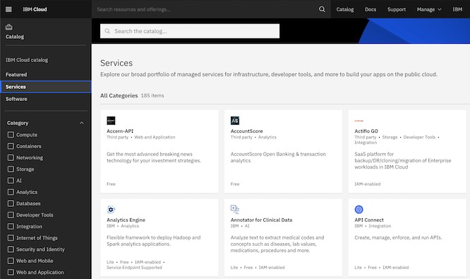
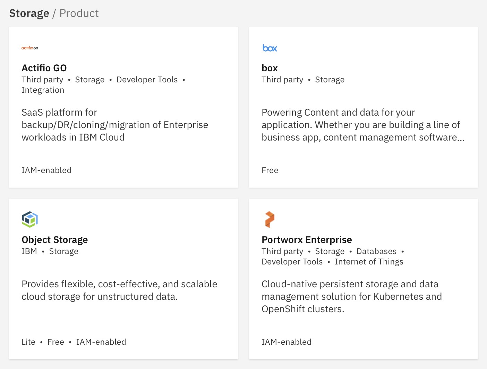

---

copyright:
  years: 2017, 2022
lastupdated: "2022-09-26"

keywords: provision, create, service

subcollection: cloud-object-storage

---

{{site.data.keyword.attribute-definition-list}}

# Choosing a plan and creating an instance
{: #provision}

Getting data into your instance of {{site.data.keyword.cos_full}} requires just a few steps before you provision your new storage.
{: shortdesc}

## About {{site.data.keyword.cos_full_notm}} plans
{: #provision-plans}

The highest level of organization in {{site.data.keyword.cos_full_notm}} is a service instance.  Each instance can hold many buckets, and each bucket can hold virtually any number of objects (files).  There are four types of Object Storage service instances:

IBM Public Cloud:

1. **Lite plan** instances are free to use, but are somewhat limited in capacity (< 25GB) and features. It is typically used for experimentation and proof-of-concept work, and will need to be converted to a Standard plan instance to access complete functionality.
2. **Standard plan** instances are the most common and are recommended for most workloads.  
3. **One Rate plan** instances should be used for [workloads that involve large volumes of outbound bandwidth](/docs/cloud-object-storage?topic=cloud-object-storage-onerate) (data transferred on public networks outside of IBM Cloud) relative to the amount of total storage capacity.

   IBM Cloud Satellite:

4.  **Satellite** instances are [run on hardware outside of IBM Cloud](/docs/cloud-object-storage?topic=cloud-object-storage-provision-cos-satellite) and are typically used for edge computing or for strict data sovereignty requirements

## Creating a {{site.data.keyword.cloud_notm}} Platform account
{: #provision-account}

Before you create a new {{site.data.keyword.cos_full_notm}} storage instance, it's necessary to create a customer account first.

1. Go to [cloud.ibm.com](https://cloud.ibm.com/){: external} and click **Create a Free Account**.
2. Complete the form with your email address, name, region, and phone number. Choose a password.
3. Follow the link provided by the confirmation email, and follow the links to log in to the {{site.data.keyword.cloud}} Platform.

Now that you have a platform account, you can create a new {{site.data.keyword.cos_short}} service instance.

## Creating a service instance
{: #provision-instance}

1. Log in to [the console](https://cloud.ibm.com/){: external}.
1. Navigate to the catalog, by clicking **Catalog** in the navigation bar.

   {: caption="Figure 1. Create an {{site.data.keyword.cloud_notm}} instance"}
   
1. Look for the **Object Storage** tile in the storage section and select it.

   {: caption="Figure 2. Select {{site.data.keyword.cos_short}}"}

1. Give the service instance a name and choose a plan.
1. Click **Create** and you're automatically redirected to your new instance.

It is also possible to manage resources using the [{{site.data.keyword.cloud}} Platform CLI](/docs/account?topic=account-manage_resource):

```bash
ibmcloud resource service-instance-create <instance-name> cloud-object-storage <plan> global
```
{: codeblock}

## Deleting a service instance
{: delete-instance}

When a service instance is deleted, the data is not deleted immediately.  Instead, it is scheduled for reclamation (by default this is set to take 7 days), after which the data is irreversibly destroyed, and the bucket names will be made available for reuse. It is also possible to [restore a deleted resource](/docs/account?topic=account-resource-reclamation#restore-resource) that has not yet been reclaimed.

It is possible to check the status of a reclamation, as well as force or cancel a scheduled reclamation using the [the {{site.data.keyword.cloud}} Platform CLI](/docs/cli?topic=cli-ibmcloud_commands_resource#ibmcloud_resource_reclamations).

It is not possible to delete a Service Instance if there is a bucket with an active Immutable Object Storage policy or legal hold on any objects.  The policy will need to expire before the data can be deleted. It isn't possible to delete a Service Instance if there is a permanent retention policy in place. 
{: important}

Currently, the reclamation can be scheduled for {{site.data.keyword.cos_full_notm}} standard plan instances only.
{: note}
