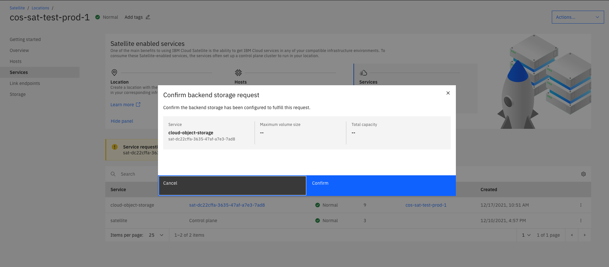

---

copyright:
  years: 2024, 2024
lastupdated: "2024-12-12"

keywords:  object storage, satellite, local

subcollection: cloud-object-storage

---

{{site.data.keyword.attribute-definition-list}}

# Provisioning {{site.data.keyword.cos_short}} for {{site.data.keyword.satelliteshort}}
{: #provision-cos-satellite}

{{site.data.keyword.cloud_notm}} continues to evaluate its service offerings periodically, keeping in perspective our client requirements and market direction. As a result, as of December 16, 2024, the {{site.data.keyword.cos_short}} for {{site.data.keyword.satelliteshort}} offering is being deprecated. For more information, see [Deprecation overview](/docs-draft/cloud-object-storage?topic=cloud-object-storage-deprecation-cos-satellite).
{: deprecated}

You can provision {{site.data.keyword.cos_short}} for {{site.data.keyword.satelliteshort}} using the IBM Cloud console.
{: shortdesc}

## Before you begin
{: #pre-provision-satellite}

Before deploying {{site.data.keyword.cos_short}} in a Satellite location, you must first deploy [a {{site.data.keyword.satelliteshort}} location](/docs/satellite?topic=satellite-locations) with sufficient computing hosts and raw block storage allocated for provisioning {{site.data.keyword.cos_short}}.

{{site.data.keyword.cos_short}} for {{site.data.keyword.satelliteshort}} only supports RHEL8.
{: note}

| Object Storage capacity | Raw storage required | Minimum host requirements            |
|-------------------------|----------------------|--------------------------------------|
| Small (12 TB)           | 18 TB                | 9 nodes of 4 vCPU and 16 GiB memory  |
| Medium (24 TB)          | 36 TB                | 9 nodes of 4 vCPU and 16 GiB memory  |
| Large (48 TB)           | 72 TB                | 9 nodes of 4 vCPU and 16 GiB memory  |
| Extra Large (96 TB)     | 144 TB               | 18 nodes of 4 vCPU and 16 GiB memory |

For more information on configuring hosts for storage, [see the {{site.data.keyword.satelliteshort}} documentation](/docs/satellite?topic=satellite-host-reqs#reqs-host-storage).

Unlike cloud storage which scales elastically, there may be negative performance impacts when an instance gets near capacity.  Workloads that demand higher performance may benefit from the additional computing power provided by the Extra Large plan, regardless of total storage required.

When provisioning block storage, is recommended to use a ["Silver" storage class at a minimum](/docs/satellite?topic=satellite-storage-class-ref) to ensure adequate performance.
{: tip}

## Configure a satellite location
{: #provision-satellite-location}

1. Follow the documentation to [create a new Satellite location](/docs/satellite?topic=satellite-locations) with [the necessary hosts](/docs/satellite?topic=satellite-attach-hosts) and [storage resources](/docs/satellite?topic=satellite-storage-template-features).
2. Grant the necessary service authorizations.
   1. Configure your IAM Authorizations under the Manage tab.
   2. Choose the **Authorizations** tab from the left hand menu.
   3. Click the **create** button to create an authorization that will allow a service instance access to another service instance. The source service is the service that is granted access to the target service. The roles you select define the level of access for this service. The target service is the service you are granting permission to be accessed by the source service based on the assigned roles.
   4. In the **Source Service** field, select **Cloud Object Storage**.
   5. In the **Target Service** field, select **Satellite**.
      1. Select all options: _Satellite Cluster Creator_, _Satellite Link Administrator_, _Satellite Link Source Access_ Controller
   6. Then **Authorize**.

## Provision an object storage service instance
{: #provision-satellite-cos}

1. Log in to [the console](https://cloud.ibm.com/){: external}.
2. Navigate to the catalog, by clicking **Catalog** in the navigation bar.
3. Look for the **Object Storage** tile in the storage section and select it.
4. Select **Satellite** from the "Choose an Infrastructure" section.
5. Choose an existing [Satellite location](/docs/satellite?topic=satellite-locations).
6. [Choose a capacity](/docs/cloud-object-storage?topic=cloud-object-storage-billing-cos-satellite) for your new {{site.data.keyword.cos_short}} instance.
7. Click **Create** and you're automatically redirected to your new instance.

## Assign hosts and storage to object storage cluster (using Satellite Storage UI)
{: #provision-satellite-assign}

To access the Storage UI for Satellite, you must be added to the allowlist. [Contact IBM](https://www.ibm.com/contact/us/en/) to learn more.
{: important}

If the location chosen for the new instance of {{site.data.keyword.cos_short}} for {{site.data.keyword.satelliteshort}} was correctly configured with the required hosts and storage available, they will be automatically queued for assignment.  This assignment requires confirmation from a Satellite administrator.

1. Log in to [the console](https://cloud.ibm.com/){: external}.
2. Navigate to Satellite, by clicking **Satellite** > **Locations** in the navigation bar.
3. Select the **Services** tab.
4. Look for the confirmation pop-up and approve the assignment.

{: caption="Confirming host and storage assignment."}
