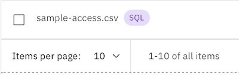
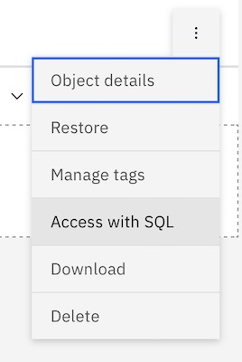
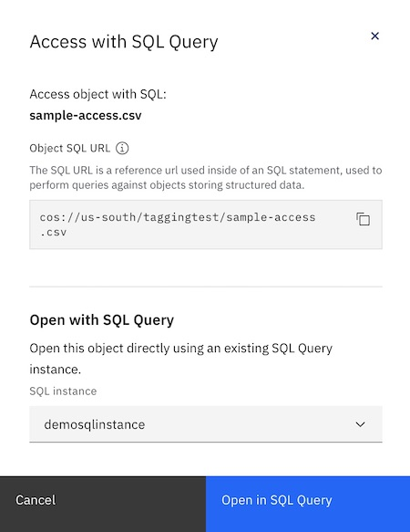
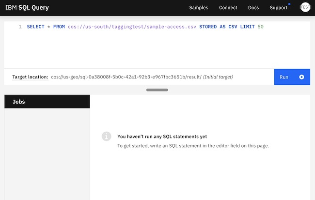
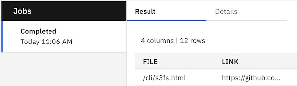
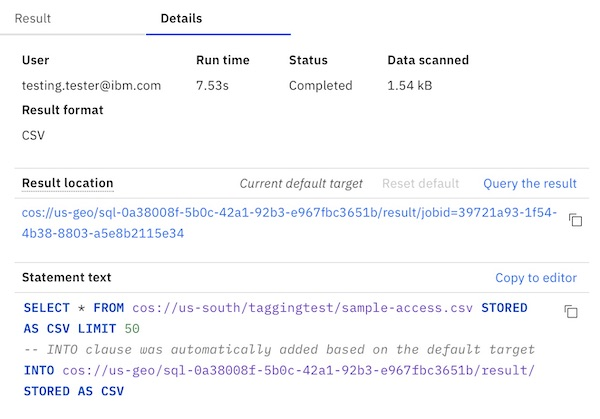

---

copyright:
  years: 2017, 2024
lastupdated: "2024-04-19"

keywords: cloud services, integration, sql, query, analytics

subcollection: cloud-object-storage

---

{{site.data.keyword.attribute-definition-list}}

# Using {{site.data.keyword.sqlquery_full}}
{: #sql-query}

{{site.data.keyword.sqlquery_full}} (formerly SQL Query) is now end of market. No new instances of {{site.data.keyword.sqlquery_short}} can be created. Existing instances can still be used until end of support. See [Deprecation of {{site.data.keyword.sqlquery_short}}](/docs/sql-query?topic=sql-query-deprecation) for more information.
{: deprecated}

{{site.data.keyword.sqlquery_full}} is a fully managed service that lets you run SQL queries (that is, `SELECT` statements) to analyze, transform, or clean up rectangular data using the full ANSI SQL standard.
{: shortdesc}

## Querying {{site.data.keyword.cos_short}} with SQL Query
{: #sql-query-querying-objects}

You can use SQL Query to create `SELECT` statements only; actions such as `CREATE`, `DELETE`, `INSERT`, and `UPDATE` are impossible.
{: tip}

Input data for your queries are read from ORC, CSV, JSON, or Parquet files located in one or more {{site.data.keyword.cos_full_notm}} instances. Each query result is written by default to a CSV file in a Cloud Object Storage instance where you created the integration. But you can freely override and customize the format and {{site.data.keyword.cos_short}} location as part of the SQL statement that you run.

You can use a custom `INTO` clause of a `SELECT` statement to control where and how result data from a `SELECT` statement is written to {{site.data.keyword.cos_full_notm}}.
{: note}

Getting started using SQL Query `SELECT` statements from inside your instance is as easy as creating an integration. Objects of data formats that can be queried, as well as folders with multiple objects of a consistent format that can be queried (when shown in the "folders" view) are labeled as shown in Figure 1.

{: caption="SQL label shows objects that can be queried"}

You can retrieve an SQL URL that can be queried for objects for a selected individual object (Object SQL URL) or for all objects currently displayed with an active prefix filter (Filtered SQL URL). You can use this URL inside the SQL statement as the table name.
{: tip}

Figure 1 shows how to access your data using {{site.data.keyword.sqlquery_short}}. When you click on the ellipses at the end of a row of an object that you can query, you will see a menu where you can "Access with SQL" by selecting that option.

{: caption="Access with SQL shows objects that can be queried"}

The panel shown in Figure 3 shows how to access your data using {{site.data.keyword.sqlquery_short}}. The location of your object appears in the panel for reference outside of the console. The instances to which you have access appear in the dropdown list in the panel. After you specify the instance, click on "Open in SQL Query" to launch your instance already pre-populated with a sample query written in the appropriate SQL.

{: caption="Access with SQL launch panel"}

Access is based on permissions, and you may wish to study more about [authentication and access](/docs/sql-query?topic=sql-query-authentication#accessauthentication).
{: important}

## Getting Results
{: #sql-query-getting-results}

Figure 4 shows a sample SQL query you can modify. By pressing the "Run" button, the list below the query will populate with a new entry that links to your results. The results will be stored in the location shown beneath the query.

{: caption="Access with SQL query window"}

The entry representing the job of the `SELECT` statement run previously is shown in Figure 5. There are two tabs, "Results" and "Details," at the top of the list that allow you to switch between seeing the results and more detailed information.

{: caption="Access with SQL query jobs"}

The entry representing the details of running the `SELECT` statement run previously is shown in Figure 6.

{: caption="Access with SQL query jobs"}

## Next Steps
{: #sql-query-next-steps}

For more information on using {{site.data.keyword.sqlquery_short}} see the [{{site.data.keyword.sqlquery_short}} documentation](/docs/sql-query?topic=sql-query-overview).
