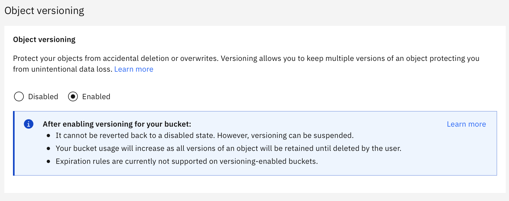
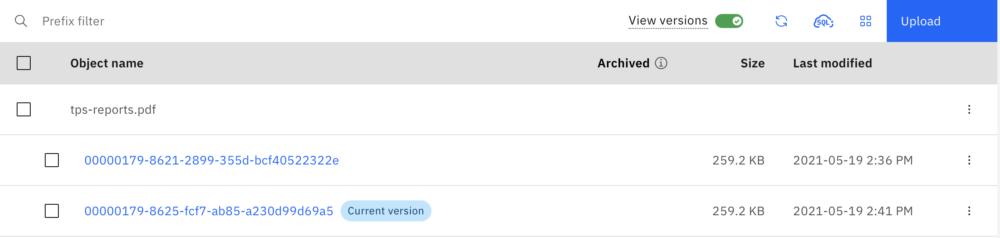

---

copyright:
  years: 2021, 2024
lastupdated: "2024-04-18"

keywords: data, versioning, loss prevention

subcollection: cloud-object-storage

---

{{site.data.keyword.attribute-definition-list}}

# Versioning objects
{: #versioning}

Versioning allows multiple revisions of a single object to exist in the same bucket. Each version of an object can be queried, read, restored from an archived state, or deleted. Enabling versioning on a bucket can mitigate data loss from user error or inadvertent deletion. When an object is overwritten, a new version is created, and the previous version of the object is automatically preserved.  Therefore, in a versioning-enabled bucket, objects that are deleted as a result of accidental deletion or overwrite can easily be recovered by restoring a previous version of the object.  If an object is deleted, it is replaced by a _delete marker_ and the previous version is saved (nothing is permanently deleted). To permanently delete individual versions of an object, a delete request must specify a _version ID_. A `GET` request for an object will retrieve the most recently stored version.  If the current version is a delete marker, IBM COS returns a `404 Not Found` error.

After a bucket has enabled versioning, all the objects in the bucket are versioned.  All new objects (created after enabling versioning on a bucket) will receive a permanently assigned version ID. Objects created before versioning was enabled (on the bucket) are assigned a version of `null`.  When an object with a `null` version ID is overwritten or deleted it is assigned a new version ID. Suspending versioning does not alter any existing objects, but will change the way future requests are handled by IBM COS. Once enabled, versioning can only be suspended, and not fully disabled.  Therefore, a bucket can have three states related to versioning: 1. Default (unversioned), 2. Enabled, or 3. Suspended.

## Getting started with versioning
{: #versioning-getting-started}

First, create a new bucket with object versioning enabled.

1. After navigating to your object storage instance, click on **Create bucket**.
2. Choose a region and resiliency, then look for **Object versioning** and toggle the selector to **Enabled**.

{: caption="Enable versioning"}

Then create a versioned object.

1. Navigate your new bucket, and upload a file by dragging it onto the browser window.
2. After the object has uploaded successfully, upload another object with the same name.  Instead of being overwritten, the file will be assigned a UUID and saved as a non-current version of the object.
3. Toggle **View versions** to see and interact with alternate versions of objects.

{: caption="View versions"}

## Terminology
{: #versioning-terminology}

**Delete marker**: An 'invisible' object that allows for accessing versions of the deleted object.

**Version ID**: A Unicode, UTF-8 encoded, URL-safe, opaque string that indicates a unique version of an object and associated metadata, and is used to target requests to that particular version. Version IDs are a maximum of 1,024 bytes long.

**'null'**: A special version ID assigned to objects that existed when versioning was enabled on a bucket.

## Consistency and data integrity
{: #versioning-consistency}

While IBM COS provides strong consistency for all data IO operations, bucket configuration is eventually consistent. After enabling versioning for the first time on a bucket, it may take a few moments for the configuration to propagate across the system. Although versioning may appear to be enabled, it is recommended to wait 5 minutes after enabling versioning to make any requests that are expected to create versions or delete markers.

## IAM actions
{: #versioning-iam}

There are new IAM actions associated with versioning.

| IAM Action | Role |
| --- | --- |
| cloud-object-storage.bucket.put_versioning |  Manager, Writer |
| cloud-object-storage.bucket.get_versioning |  Manager, Writer, Reader |
| cloud-object-storage.object.get_version |  Manager, Writer, Reader, Content Reader, Object Reader |
| cloud-object-storage.object.head_version |  Manager, Writer, Reader, Content Reader, Object Reader |
| cloud-object-storage.bucket.delete_version |  Manager, Writer |
| cloud-object-storage.object.get_versions |  Manager, Writer, Reader, Content Reader, Object Reader |
| cloud-object-storage.object.copy_get_version |  Manager, Writer, Reader |
| cloud-object-storage.object.copy_part_get_version |  Manager, Writer, Reader |
| cloud-object-storage.object.restore_version |  Manager, Writer |
| cloud-object-storage.object.put_tagging_version |  Manager, Writer, Object Writer |
| cloud-object-storage.object.get_tagging_version |  Manager, Writer, Reader |
| cloud-object-storage.object.delete_tagging_version |  Manager, Writer |
{: caption="IAM actions associated with versioning" caption-side="top"}

## Activity Tracker events
{: #versioning-at}

Versioning will generate new events.

- `cloud-object-storage.bucket-versioning.create`
- `cloud-object-storage.bucket-versioning.read`
- `cloud-object-storage.bucket-versioning.list`

Management events for versioned buckets contain a `requestData.versioning.state` field, indicating whether versioning is enabled or suspended on a bucket.

The basic `HEAD`, `GET`, `PUT`, and `DELETE` actions that act on or create versions of objects will include a `target.versionId` field.  The `target.versionId` field is also present when completing a multipart upload and when copying objects or parts, if a new version is created because of those actions.

A `responseData.deleteMarker.created` field is present when an object is deleted and a delete marker is created.

## Usage and accounting
{: #versioning-usage}

All versions are metered as if they were equal objects.  This means that if a bucket contains a single object with five previous versions, the `object_count` field returned by the [Resource Configuration API](https://cloud.ibm.com/apidocs/cos/cos-configuration) will be `6`, even though it will appear as if there is only a single object in the bucket.  Likewise, accumulated versions contribute to total usage and are billable. In addition to the `object_count` field returned by the [Read Bucket Metadata API](https://cloud.ibm.com/apidocs/cos/cos-configuration), the API response body contains several new fields associated with versioning:

- `noncurrent_object_count`: Number of non-current object versions in the bucket in `int64` format.
- `noncurrent_bytes_used`: Total size of all non-current object versions in the bucket in `int64` format.
- `delete_marker_count`: Total number of delete markers in the bucket in `int64` format.

As mentioned, versioning can only be enabled or suspended. If for any reason there is a desire to completely disable versioning, then it is necessary to migrate the contents of the bucket to a new bucket that does not have versioning enabled.

## Interactions
{: #versioning-limitations}

The IBM COS implementation of the S3 APIs for versioning is identical to the AWS S3 APIs for versioning, with a few differences.

### Archiving and expiring versioned objects
{: #versioning-archive}

Lifecycle configurations are permitted in a version-enabled bucket.  However, unlike Amazon S3, new versions are subject to the archive rule in the same manner as regular objects. Objects are given a transition date when they are created, and are archived on their individual transition date, regardless of whether they are current or non-current versions.  Overwriting an object does not affect the transition date of the previous version, and the new (current) version will be assigned a transition date.

It is not possible to use `NoncurrentVersionTransition` rules to archive _only_ non-current versions of objects in a lifecycle configuration.

### Immutable Object Storage (WORM)
{: #versioning-worm}

The IBM COS implementation of Immutable Object Storage (that is, retention policies) is not permitted in buckets with versioning enabled. Attempts to create a retention policy will fail, as will attempts to enable versioning on a bucket with an retention policy.  

## Supported S3 APIs
{: #versioning-apis}

The following set of REST APIs can interact with versioning in some way:

- `GET Object`
- `HEAD Object`
- `DELETE Object`
- `GET Object ACL`
- `PUT Object ACL`
- `Upload Part Copy`
- `Restore Object`
- `DELETE Objects`
- `List Object Versions`
- `PUT Bucket Versioning`
- `GET Bucket Versioning`
- `PUT Object`
- `POST Object`
- `Copy Object`
- `Complete Multipart Upload`
- `PUT Object Tagging`
- `GET Object Tagging`
- `DELETE Object Tagging`
- `PUT Bucket Lifecycle`
- `GET Bucket Lifecycle`
- `DELETE Bucket Lifecycle`

## REST API examples
{: #versioning-apis-examples}

The following examples are shown using cURL for ease of use. Environment variables are used to represent user specific elements such as `$BUCKET`, `$TOKEN`, and `$REGION`.  Note that `$REGION` would also include any network type specifications, so sending a request to a bucket in `us-south` using the private network would require setting the variable to `private.us-south`.

### Enable versioning on a bucket
{: #versioning-apis-enable}

```curl
curl -X "PUT" "https://$BUCKET.s3.$REGION.cloud-object-storage.appdomain.cloud/?versioning" \
     -H 'Authorization: bearer $TOKEN' \
     -H 'Content-MD5: 8qj8HSeDu3APPMQZVG06WQ==' \
     -H 'Content-Type: text/plain; charset=utf-8' \
     -d $'<VersioningConfiguration>
            <Status>Enabled</Status>
          </VersioningConfiguration>'
```

A successful request returns a `200` response.

### Suspend versioning on a bucket
{: #versioning-apis-suspend}

```curl
curl -X "PUT" "https://$BUCKET.s3.$REGION.cloud-object-storage.appdomain.cloud/?versioning" \
     -H 'Authorization: bearer $TOKEN' \
     -H 'Content-MD5: hxXDWuCDWB72Be0LG4XniQ==' \
     -H 'Content-Type: text/plain; charset=utf-8' \
     -d $'<VersioningConfiguration>
            <Status>Suspended</Status>
          </VersioningConfiguration>'
```

A successful request returns a `200` response.

### List versions of objects in a bucket
{: #versioning-apis-list}

```curl
curl -X "GET" "https://$BUCKET.s3.$REGION.cloud-object-storage.appdomain.cloud/?versions" \
     -H 'Authorization: bearer $TOKEN'
```

This returns an XML response body:

```xml
<ListVersionsResult>
   <IsTruncated>boolean</IsTruncated>
   <KeyMarker>string</KeyMarker>
   <VersionIdMarker>string</VersionIdMarker>
   <NextKeyMarker>string</NextKeyMarker>
   <NextVersionIdMarker>string</NextVersionIdMarker>
   <Version>
      <ETag>string</ETag>
      <IsLatest>boolean</IsLatest>
      <Key>string</Key>
      <LastModified>timestamp</LastModified>
      <Owner>
         <DisplayName>string</DisplayName>
         <ID>string</ID>
      </Owner>
      <Size>integer</Size>
      <StorageClass>string</StorageClass>
      <VersionId>string</VersionId>
   </Version>
   ...
   <DeleteMarker>
      <IsLatest>boolean</IsLatest>
      <Key>string</Key>
      <LastModified>timestamp</LastModified>
      <Owner>
         <DisplayName>string</DisplayName>
         <ID>string</ID>
      </Owner>
      <VersionId>string</VersionId>
   </DeleteMarker>
   ...
   <Name>string</Name>
   <Prefix>string</Prefix>
   <Delimiter>string</Delimiter>
   <MaxKeys>integer</MaxKeys>
   <CommonPrefixes>
      <Prefix>string</Prefix>
   </CommonPrefixes>
   ...
   <EncodingType>string</EncodingType>
</ListVersionsResult>
```

**`delimiter`**: A delimiter is a character that you specify to group keys. All keys that contain the same string between the prefix and the first occurrence of the delimiter are grouped under a single result element in `CommonPrefixes`. These groups are counted as one result against the max-keys limitation. These keys are not returned elsewhere in the response.

**`encoding-type`**: Requests COS to url-encode the object keys in the response. Object keys may contain any Unicode character; however, XML 1.0 parser cannot parse some characters, such as characters with an ASCII value from 0 to 10. For characters that are not supported in XML 1.0, you can add this parameter to request that COS encodes the keys in the response. Valid value: `url`.

**`key-marker`**: Specifies the key to start with when listing objects in a bucket.

**`max-keys`**: Sets the maximum number of keys returned in the response. By default the API returns up to 1,000 key names. The response might contain fewer keys but will never contain more.

**`prefix`**: Use this parameter to select only those keys that begin with the specified prefix.

**`version-id-marker`**: Specifies the object version you want to start listing from.

### Operations on specific versions of objects
{: #versioning-apis-objects}

Several APIs make use of a new query parameter (`?versionId=<VersionId>`) that indicates which version of the object you are requesting. This parameter is used in the same manner for reading, deleting, checking metadata and tags, and restoring archived objects. For example, to read a version of an object `foo` with a version ID of `L4kqtJlcpXroDVBH40Nr8X8gdRQBpUMLUo`, the request might look like the following:

```curl
curl -X "GET" "https://$BUCKET.s3.$REGION.cloud-object-storage.appdomain.cloud/foo?versionId=L4kqtJlcpXroDVBH40Nr8X8gdRQBpUMLUo" \
     -H 'Authorization: bearer $TOKEN'
```

Deleting that object is done in the same manner.

```curl
curl -X "DELETE" "https://$BUCKET.s3.$REGION.cloud-object-storage.appdomain.cloud/foo?versionId=L4kqtJlcpXroDVBH40Nr8X8gdRQBpUMLUo" \
     -H 'Authorization: bearer $TOKEN'
```

For requests that already make use of a query parameter, the `versionId` parameter can be added to the end.

```curl
curl -X "GET" "https://$BUCKET.s3.$REGION.cloud-object-storage.appdomain.cloud/foo?tagging&versionId=L4kqtJlcpXroDVBH40Nr8X8gdRQBpUMLUo" \
     -H 'Authorization: bearer $TOKEN'
```

Server-side copying of object versions is supported, but uses a slightly different syntax.  The query parameter is not added to the URL itself, but instead is appended to the `x-amz-copy-source` header. This is the same syntax as creating a part for a multipart part from a source object.

```curl
curl -X "PUT" "https://$BUCKET.s3.$REGION.cloud-object-storage.appdomain.cloud/<new-object-key>"
 -H "Authorization: bearer $TOKEN"
 -H "x-amz-copy-source: /<source-bucket>/<object-key>?versionId=L4kqtJlcpXroDVBH40Nr8X8gdRQBpUMLUo"
```

## CLI examples
{: #versioning-cli-examples}

You can use the IBM Cloud CLI with the `cos` plug-in to enable versioning on a bucket.

```sh
cos bucket-versioning-put --bucket $BUCKET --versioning-configuration file://vers.json
```

In this case, `vers.json` is a simple document:

```json
{
    "Status": "Enabled"
}
```

## SDK examples
{: #versioning-sdks}

The following examples make use of the IBM COS SDKs for Python and Node.js, although the implementation of object versioning should be fully compatible with any S3-compatible library or tool that allows for the setting of custom endpoints.  Using third-party tools requires HMAC credentials in order to calculate AWS V4 signatures.  For more information on HMAC credentials, [see the documentation](https://cloud.ibm.com/docs/cloud-object-storage?topic=cloud-object-storage-uhc-hmac-credentials-main).

### Python
{: #versioning-sdks-python}

Enabling versioning using the IBM COS SDK for Python can be done using either the [high-level resource](https://ibm.github.io/ibm-cos-sdk-python/reference/services/s3.html#service-resource) or [low-level client](https://ibm.github.io/ibm-cos-sdk-python/reference/services/s3.html#client) syntax.

Using a resource:

```python
#!/usr/bin/env python3

import ibm_boto3
from ibm_botocore.config import Config
from ibm_botocore.exceptions import ClientError

#Define constants
API_KEY = os.environ.get('IBMCLOUD_API_KEY')
SERVICE_INSTANCE = os.environ.get('SERVICE_INSTANCE_ID')
ENDPOINT = os.environ.get('ENDPOINT')

BUCKET = "my-versioning-bucket" # The bucket that will enable versioning.

#Create resource client with configuration info pulled from environment variables.
cos = ibm_boto3.resource("s3",
                         ibm_api_key_id=API_KEY,
                         ibm_service_instance_id=SERVICE_INSTANCE,
                         config=Config(signature_version="oauth"),
                         endpoint_url=ENDPOINT
                         )

versioning = cos.BucketVersioning(BUCKET)

versioning.enable()

```

Versioning for the bucket can then be suspended using `versioning.suspend()`

Using that same `cos` resource, all versions of objects could be listed using the following:

```python
versions = s3.Bucket(BUCKET).object_versions.filter(Prefix=key)

for version in versions:
    obj = version.get()
    print(obj.get('VersionId'), obj.get('ContentLength'), obj.get('LastModified'))
```

Using a client:

```python
#!/usr/bin/env python3

import ibm_boto3
from ibm_botocore.config import Config
from ibm_botocore.exceptions import ClientError

#Define constants
API_KEY = os.environ.get('IBMCLOUD_API_KEY')
SERVICE_INSTANCE = os.environ.get('SERVICE_INSTANCE_ID')
ENDPOINT = os.environ.get('ENDPOINT')

BUCKET = "my-versioning-bucket" # The bucket that will enable versioning.

#Create resource client with configuration info pulled from environment variables.
cosClient = ibm_boto3.client("s3",
                         ibm_api_key_id=API_KEY,
                         ibm_service_instance_id=SERVICE_INSTANCE,
                         config=Config(signature_version="oauth"),
                         endpoint_url=ENDPOINT
                         )

response = cosClient.put_bucket_versioning(
    Bucket=BUCKET,
    VersioningConfiguration={
        'Status': 'Enabled'
    }
)
```

Listing the versions of an object using the same client:

```python
resp = cosClient.list_object_versions(Prefix='some-prefix', Bucket=BUCKET)
```

Note that the Python APIs are very flexible, and there are many different ways to accomplish the same task.

### Node.js
{: #versioning-sdks-node}

Enabling versioning using the [IBM COS SDK for Node.js](https://ibm.github.io/ibm-cos-sdk-js/AWS/S3.html#putBucketVersioning-property):

```js
const IBM = require('ibm-cos-sdk');

var config = {
    endpoint: '<endpoint>',
    apiKeyId: '<api-key>',
    serviceInstanceId: '<resource-instance-id>',
};

var cos = new IBM.S3(config);

var params = {
    Bucket: 'my-versioning-bucket', /* required */
    VersioningConfiguration: { /* required */
    Status: 'Enabled'
   },
};

s3.putBucketVersioning(params, function(err, data) {
   if (err) console.log(err, err.stack); // an error occurred
   else     console.log(data);           // successful response
});
```
